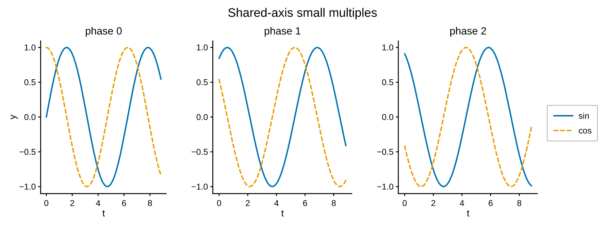
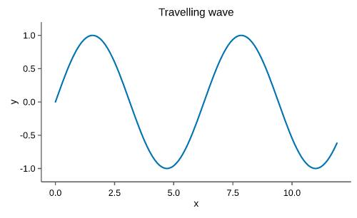

# Gallery

A tour of what pyplotrs can draw. Every entry below is a **complete, runnable
script** — copy it, run it, and you get the figure shown. (Scripts live in
[`examples/`](https://github.com/tkclam/pyplotrs/tree/main/examples) and save a
PNG into the current directory.)

<div class="grid cards" markdown>

- [](#line-plot) **Line**
- [](#scatter) **Scatter**
- [](#bar-chart) **Bar**
- [](#histogram) **Histogram**
- [](#fill-between) **Fill between**
- [](#error-bars) **Error bars**
- [](#heatmap) **Heatmap**
- [](#colormaps) **Colormaps**
- [](#3d-surface) **3D surface**
- [](#3d-scatter) **3D scatter**
- [](#3d-line) **3D line**
- [](#subplots) **Subplots**
- [](#latex-math) **LaTeX math**
- [](#annotations) **Annotations**
- [](#animation) **Animation**

</div>

---

## Basic plots

### Line plot

{ width="340" }

```python
--8<-- "examples/line.py"
```

### Scatter

{ width="340" }

```python
--8<-- "examples/scatter.py"
```

### Bar chart

{ width="340" }

```python
--8<-- "examples/bar.py"
```

### Histogram

{ width="340" }

```python
--8<-- "examples/histogram.py"
```

### Fill between

{ width="340" }

```python
--8<-- "examples/fill_between.py"
```

### Error bars

{ width="340" }

```python
--8<-- "examples/errorbar.py"
```

---

## Images & colormaps

### Heatmap

{ width="340" }

```python
--8<-- "examples/heatmap.py"
```

### Colormaps

{ width="500" }

```python
--8<-- "examples/colormaps.py"
```

---

## 3D

### 3D surface

{ width="500" }

```python
--8<-- "examples/surface3d.py"
```

### 3D scatter

{ width="500" }

```python
--8<-- "examples/scatter3d.py"
```

### 3D line

{ width="500" }

```python
--8<-- "examples/line3d.py"
```

---

## Layout & styling

### Subplots

{ width="640" }

```python
--8<-- "examples/subplots.py"
```

### Themes

<div class="grid" markdown>


</div>

```python
--8<-- "examples/themes.py"
```

---

## Math & annotations

### LaTeX math

{ width="340" }

```python
--8<-- "examples/math_labels.py"
```

### Annotations

{ width="340" }

```python
--8<-- "examples/annotations.py"
```

---

## Animation

### Animation

{ width="420" }

```python
--8<-- "examples/animation_wave.py"
```
