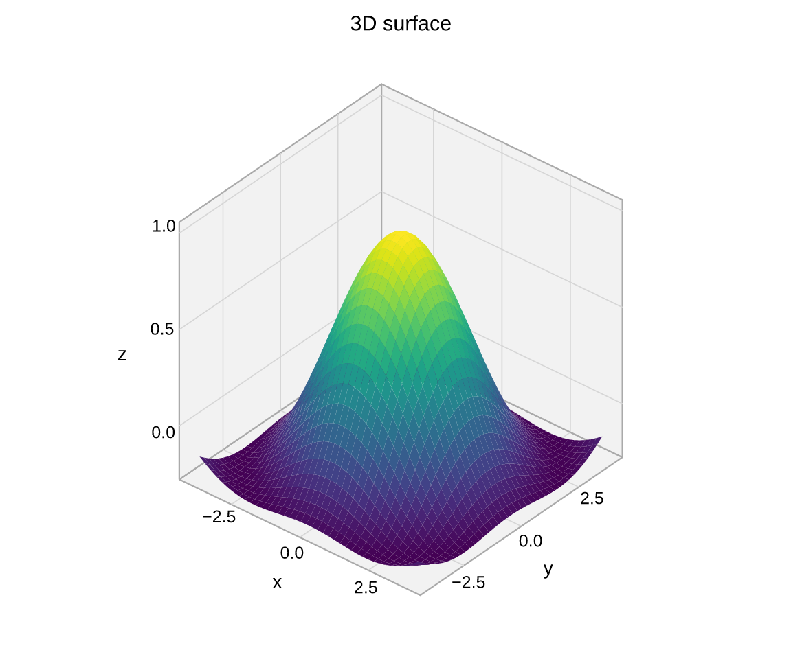
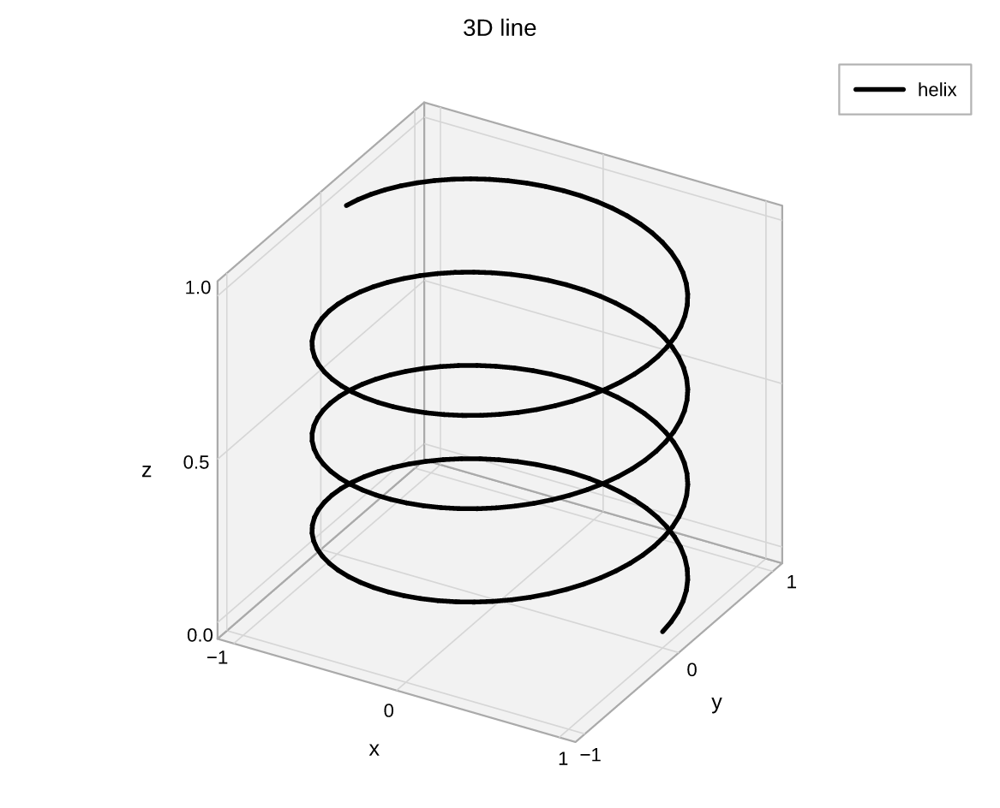
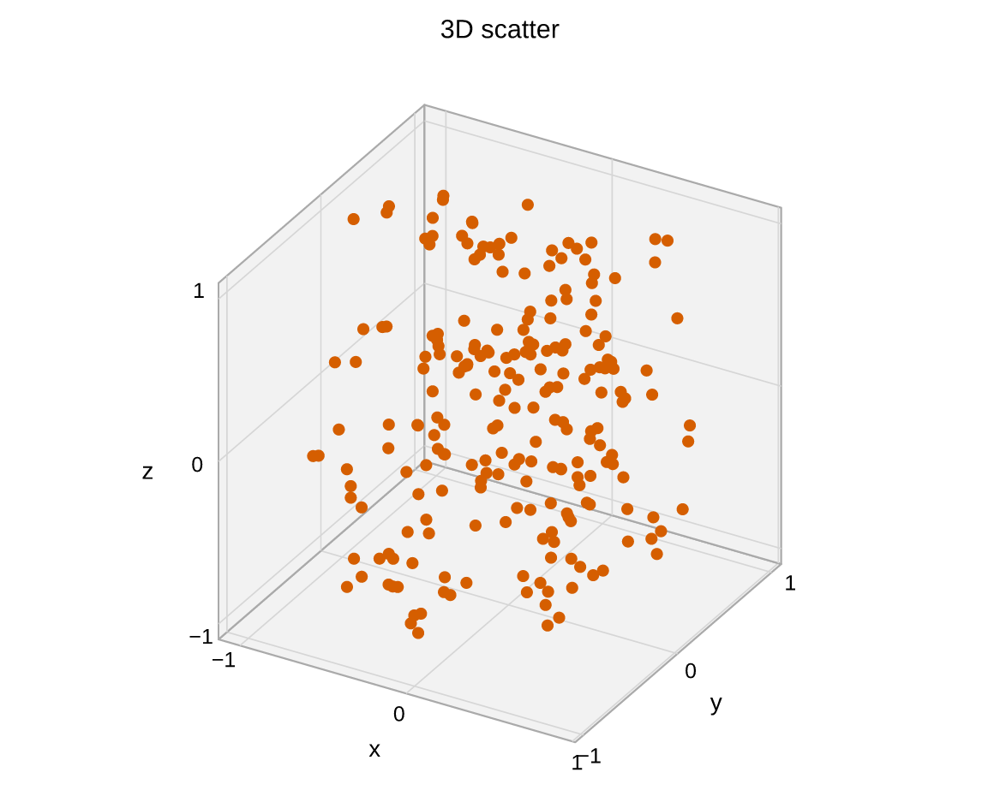

# 3D plots

pyplotrs' 3D support is a **projection layer**, not a separate renderer: an
orthographic camera turns 3D primitives into ordinary 2D paths and text (with
painter's-algorithm depth sorting), which then flow through the same PDF/SVG/PNG
backends as everything else. The practical upshot is that **3D figures keep real
editable text and stay fully vector** — a surface exports as ~vector quads, not a
rasterized image.

Make every axes of a figure 3D with `projection="3d"`:

```python
import pyplotrs as plt

fig, ax = plt.subplots(projection="3d")
```

## Surfaces

[`surface`][pyplotrs.axes3d.Axes3D.surface] draws a colormapped surface over a
grid `(X, Y, Z)`. `Z` is a 2D `nrows × ncols` grid; `X`/`Y` may be matching 2D
grids or 1D coordinate vectors that are broadcast.

```python
--8<-- "examples/surface3d.py"
```

{ width="480" }

## Lines

[`plot`][pyplotrs.axes3d.Axes3D.plot] (alias `plot3d`) draws a 3D polyline:

```python
--8<-- "examples/line3d.py"
```

{ width="480" }

## Scatter

[`scatter`][pyplotrs.axes3d.Axes3D.scatter] (alias `scatter3d`) places
depth-sorted markers:

```python
--8<-- "examples/scatter3d.py"
```

{ width="480" }

## Camera & labels

Set the view angle and axis labels through
[`set`][pyplotrs.axes3d.Axes3D.set]:

```python
ax.set(title="…", xlabel="x", ylabel="y", zlabel="z",
       elev=35, azim=-50, zlim=(0, 1))
```

`elev` is the angle above the x–y plane and `azim` the rotation about the
vertical axis (degrees), matching matplotlib's mplot3d convention.

## Interactive HTML

Saving a 3D figure to `.html` produces a **dependency-free Canvas2D viewer** you
can orbit (drag), zoom (scroll) and pan (shift-drag):

```python
fig.save("surface.html")
```

!!! note "Depth sorting"
    Surfaces, lines and points are depth-sorted within each group rather than
    merged into one global painter's order, so a line can occasionally draw over
    a surface bump it is technically behind. This is fine for typical scenes.
