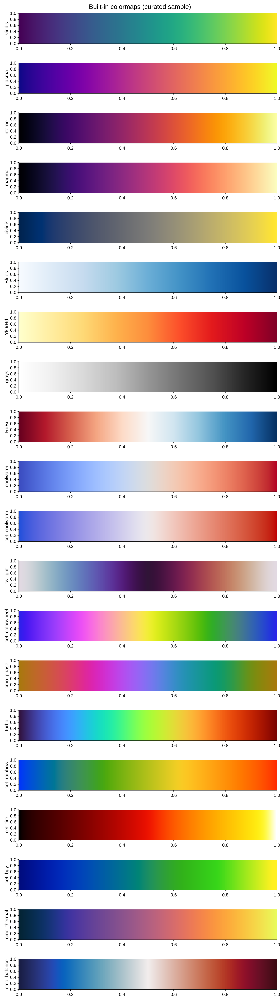

# Colormaps & images

## Displaying a field

[`imshow`][pyplotrs.axes.Axes.imshow] renders a 2D array of numbers as a
colormapped image. `data` is a sequence of equal-length rows.

```python
--8<-- "examples/heatmap.py"
```

{ width="340" }

Key options:

| Argument | Meaning |
|---|---|
| `cmap` | a colormap name or a `Colormap` (default `"viridis"`) |
| `vmin`, `vmax` | data values mapped to the low/high end (default: data min/max) |
| `norm` | a [`Normalize`][pyplotrs.norms.Normalize] (or `"log"`) for a non-linear color scale |
| `extent` | `(x0, x1, y0, y1)` data coordinates of the image edges |
| `origin` | `"upper"` (row 0 at top, default) or `"lower"` |
| `alpha` | mark-level opacity |

Non-finite values (`NaN`/`inf`) render as transparent, so masked regions show
the background through.

`matshow` is `imshow` with matrix conventions (origin top-left, equal aspect),
and `spy` marks the nonzero entries of a sparse pattern. For irregular grids
reach for `pcolormesh(X, Y, C)`; for a dense point cloud, `hexbin` or `hist2d`.
All of them return the same kind of handle.

## Colorbars

The colormapped marks return a handle you pass to
[`Figure.colorbar`][pyplotrs.Figure.colorbar]; the colorbar is laid out
in a reserved band beside its axes, so it never overlaps the data:

```python
m = ax.imshow(data, cmap="magma", vmin=0, vmax=1)
fig.colorbar(m, label="intensity")
```

```python
fig.colorbar(m, label="counts",
             orientation="horizontal",   # a band under the plot instead
             shrink=0.8,                 # 80% of the plot extent, centered
             ticks=[0, 50, 100],
             format="{x:.0f}")           # anything pyplotrs.ticker accepts
```

The tick scale follows the mappable's norm, so a `LogNorm` image gets
log-spaced colorbar ticks without further arrangement.

## Color scales

Pass a [`Normalize`][pyplotrs.norms.Normalize] to control how values map onto
the colormap — linear (the default), `LogNorm`, `TwoSlopeNorm` for diverging
data about a center, or `BoundaryNorm` for discrete bands. See
[scales & ticks](scales-and-ticks.md#color-scales-norms).

## Built-in colormaps

127 continuous colormaps ship as **exact** 256-entry tables — bit-for-bit
faithful to their upstream source, not approximations — curated from three
places:

* **matplotlib** — the perceptually-uniform maps (`viridis`, `plasma`,
  `inferno`, `magma`, `cividis`), the ColorBrewer-derived sequential/diverging
  families (`Blues`, `RdBu`, `Spectral`, …), the cyclic maps (`twilight`,
  `hsv`), and the miscellaneous/rainbow family (`turbo`, `cubehelix`, …) —
  upstream names and casing kept exactly.
* **[colorcet](https://colorcet.holoviz.org/)** — prefixed `cet_` (e.g.
  `cet_fire`, `cet_coolwarm`, `cet_glasbey` for large categorical sets — see
  [Palettes][pyplotrs.palettes]). CC-BY 4.0, Peter Kovesi et al.
* **[cmocean](https://matplotlib.org/cmocean/)** — prefixed `cmo_` (e.g.
  `cmo_thermal`, `cmo_balance`, `cmo_phase`), oceanography-oriented maps. MIT,
  Kristen Thyng et al.

Append `_r` to any name to reverse it (e.g. `"viridis_r"`).

```python
--8<-- "examples/colormaps.py"
```

{ width="480" }

List them at runtime, optionally filtered to a category (`"sequential"`,
`"diverging"`, `"cyclic"`, `"perceptually_uniform"`, `"miscellaneous"`):

```python
from pyplotrs import colormaps

colormaps.available()                       # all 127 names
colormaps.available(category="diverging")   # ['BrBG', 'PRGn', ..., 'cmo_balance', ...]
colormaps.get_cmap("cmo_thermal")           # a Colormap object
```

### Picking one

- **Sequential** data (a quantity with a low and a high end) → `viridis` and
  friends. They are perceptually uniform, so equal steps in the data look like
  equal steps in the color, and they survive being printed in grayscale.
- **Diverging** data (deviation from a meaningful center) → `RdBu`,
  `cmo_balance`, `Spectral`, paired with a `TwoSlopeNorm` so the center sits
  where it should.
- **Cyclic** data (phase, direction, time of day) → `twilight`, `cmo_phase`.
- **Categorical** data (a handful of distinct groups, not a scale) → *not* a
  colormap at all; see [`pyplotrs.palettes`][pyplotrs.palettes] below.

Avoid rainbow maps (`jet`, `hsv`) for quantitative data: they band, invert
perceived ordering, and fail in grayscale. They ship because reproducing an
existing figure sometimes requires them.

## Categorical palettes

For a handful of distinct groups, use [`palettes`][pyplotrs.palettes] — short
lists of colors meant to be *distinguishable*, not ordered:

```python
from pyplotrs import palettes, themes

palettes.available()             # ['Accent', 'Dark2', ..., 'tab20c']
palettes.get("tab10")            # ((31, 119, 180, 255), ...)

mine = themes.default.with_(palette=palettes.get("tab10"))
```

The set covers matplotlib's `tab*`, the ColorBrewer qualitative sets, seaborn's
named palettes (`sns_*`), and colorcet's `glasbey` family for many-category
data. The theme default is Okabe-Ito, colorblind-safe by construction.

Colorblind-safe is not the same as grayscale-safe, and Okabe-Ito is only the
first. Its C1 (orange) and C2 (sky blue) sit at L\* 70.6 and 69.8 — under a
point apart, so a monochrome press cannot tell them from each other however
well they separate in color. Past two series, either pair color with
`linestyle` so the distinction survives the loss of hue, or switch to
`theme="grayscale"`, which is built to separate on lightness alone.

## Custom colormaps

Build a [`Colormap`][pyplotrs.colormaps.Colormap] from a short list of
`(position, (r, g, b))` stops:

```python
from pyplotrs.colormaps import Colormap

warm = Colormap("warm", [
    (0.0, (0, 0, 0)),
    (0.5, (200, 60, 0)),
    (1.0, (255, 220, 80)),
])
ax.imshow(data, cmap=warm)
```

Stops are resampled to 256 entries by interpolating in **Oklab** by default —
a perceptually uniform color space, so the gradient looks smooth rather than
banding or dipping in perceived brightness the way interpolating raw sRGB
does. Pass `space="srgb"` for the old naive-lerp behavior, or `"lab"` /
`"linear"` for the other supported spaces.

A `Colormap` is a callable `t -> (r, g, b, a)` over `t` in `[0, 1]`, so you can
sample it directly (e.g. to color a series), and `warm.reversed()` flips it.
An exact 256-entry table can be passed as `table=` instead of `stops=`.

## Checking a colormap

[`pyplotrs.color`][pyplotrs.color] is a small color-science module backed by the
same Rust crate as the tables. It converts between sRGB, linear RGB, XYZ, Lab,
Oklab, Oklch and CAM16-UCS, and scores colormaps:

```python
from pyplotrs import color
from pyplotrs.colormaps import get_cmap

color.cvd_safe_report(get_cmap("viridis"))   # per-CVD-kind distinguishability
color.perceptual_uniformity(warm)            # 0.0 = perfectly even steps; lower is better
color.simulate_cvd((214, 39, 40), "deuteranopia")
color.distance((0, 0, 0), (10, 10, 10))      # perceptual ΔE
```

Use it to check a hand-built map before committing to it, or to justify a
palette choice in a methods section. See the
[color science API](../api/color.md).
