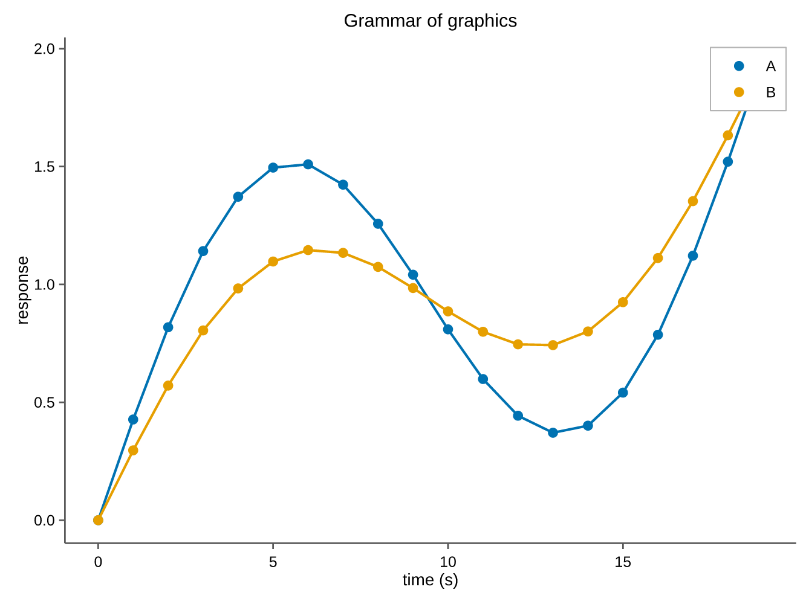
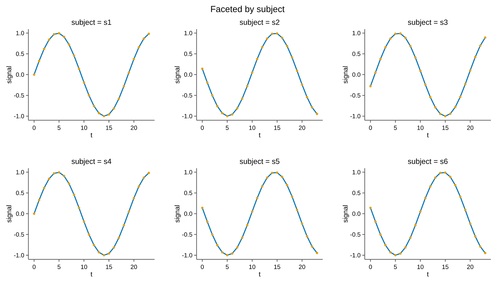

# Grammar of graphics

`pyplotrs.gg` is a small **declarative** layer in the spirit of ggplot2, built
directly on the imperative `Figure`/`Axes` API. Anything it produces is an
ordinary pyplotrs figure — same editable-text PDF/SVG, same themes.

A [`Plot`][pyplotrs.gg.Plot] binds tabular data to aesthetics (`x`, `y`,
`color`), adds one or more *geoms*, and optionally *facets* into small multiples.

```python
--8<-- "examples/gg_scatter.py"
```

{ width="520" }

## Data

Data may be any of:

- a **dict of columns** (`{"x": [...], "y": [...]}`);
- a **list of record dicts** (`[{"x": 1, "y": 2}, ...]`);
- a **DataFrame-like** object exposing `.columns` and `df[col]` (pandas / polars).

There is no hard dependency on pandas or polars.

## Geoms

| Geom | Draws |
|---|---|
| `Point(size=, marker=)` | scatter points |
| `Line(width=, linestyle=)` | a polyline, sorted by `x` |
| `Area(baseline=, alpha=)` | a filled area to a baseline |
| `Histogram(bins=, density=)` | a binned-count histogram of `x` |

Add as many as you like; they stack in one panel:

```python
from pyplotrs import gg

(gg.Plot(data, x="t", y="y")
    .add(gg.Area(alpha=0.2))
    .add(gg.Line())
    .add(gg.Point(size=12))
    .build())
```

## Mapping colour to a category

When `color` names a column, the data is split into one series per level, each
getting a distinct palette colour and a legend entry (shared across geoms):

```python
gg.Plot(data, x="t", y="y", color="treatment").add(gg.Point()).add(gg.Line())
```

## Faceting

`facet(facet.wrap(col, ncols=))` draws one panel per level of a column, with
shared scales and a single figure legend:

```python
--8<-- "examples/gg_facet.py"
```

{ width="640" }

## Labels, theme, size & output

`Plot` is chainable; the terminal methods are
[`build`][pyplotrs.gg.Plot.build] (returns a `Figure`) and
[`save`][pyplotrs.gg.Plot.save]:

```python
(gg.Plot(data, x="t", y="y", color="g")
    .add(gg.Point())
    .facet(gg.facet.wrap("subject", ncols=3))
    .theme("nature")
    .labs(x="time (s)", y="response", title="Trials")
    .figsize(800, 500)
    .save("trials.pdf"))
```
