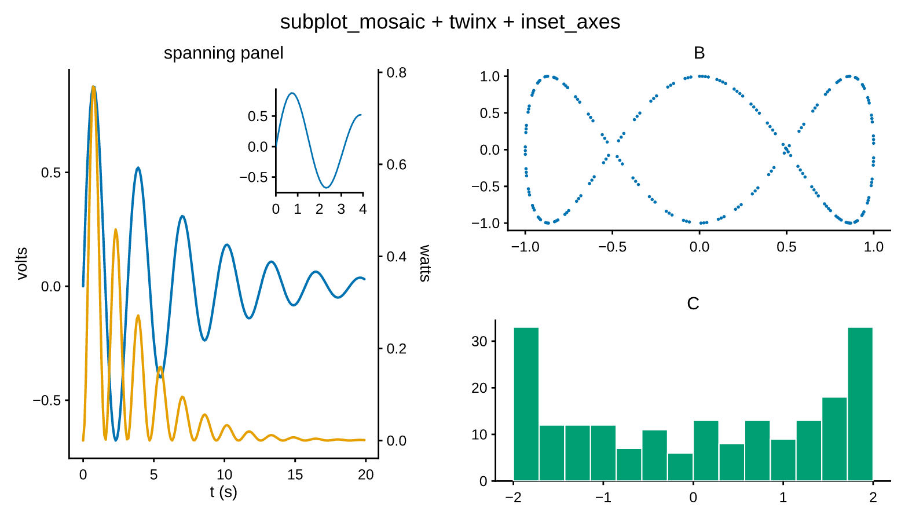

# Layout

[Figures & axes](figure-and-axes.md) covered the regular `subplots` grid. This
page covers everything past it: uneven grids, panels that span cells, axes
placed inside other axes, and second axes stacked on the same cell.

```python
--8<-- "examples/layout.py"
```

{ width="560" }

## Uneven grids

`width_ratios` and `height_ratios` weight the columns and rows:

```python
fig, axs = plt.subplots(1, 2, width_ratios=[3, 1])   # wide panel, narrow panel
fig, axs = plt.subplots(2, 1, height_ratios=[3, 1])  # plot over a residual strip
```

Only the proportions matter — `[3, 1]` and `[0.75, 0.25]` are the same — and the
gutters keep their size, so weighting changes the panels rather than the space
between them. A malformed hint (wrong length, zero or negative) falls back to an
even grid instead of raising.

## Spanning panels: `subplot_mosaic`

An ASCII drawing of the layout is usually clearer than index arithmetic.
[`subplot_mosaic`][pyplotrs.subplot_mosaic] takes one and hands back a
dict keyed by the labels:

```python
fig, axd = plt.subplot_mosaic(
    """
    AAB
    AAC
    .DC
    """
)
axd["A"].line(xs, ys)
axd["D"].hist(samples)
```

`A` spans the top-left 2×2 block, `C` spans two rows of the right column, and
`.` (or a space) leaves a cell empty. Each label's cells must form a solid
rectangle. The string is dedented before it is read, so the indented
triple-quoted form above means what it looks like.

## Spanning panels: `GridSpec`

The index-based route, for when the geometry is computed rather than drawn.
[`Figure.add_gridspec`][pyplotrs.Figure.add_gridspec] returns a
[`GridSpec`][pyplotrs.GridSpec] you slice NumPy-style, and
[`add_subplot`][pyplotrs.Figure.add_subplot] places an axes on the slice:

```python
fig = plt.figure(figsize=(500, 320))
gs = fig.add_gridspec(2, 3, height_ratios=[2, 1])

main  = fig.add_subplot(gs[0, :2])     # top-left, two columns wide
side  = fig.add_subplot(gs[:, 2])      # full-height right column
under = fig.add_subplot(gs[1, 0])
polar = fig.add_subplot(gs[1, 1], projection="polar")
```

[`plt.figure()`][pyplotrs.figure] creates a figure with **no** axes, which is
what you want when every panel is placed by hand. `add_subplot` takes the same
`projection` argument as `subplots`, so a single figure can mix 2D, polar and
3D panels.

## Shared axes

`sharex` / `sharey` unify the data range across all panels, so they line up and
are directly comparable:

```python
fig, axs = plt.subplots(1, 3, sharey=True)
for k, ax in enumerate(axs):
    ax.line(xs, [f(x, k) for x in xs])
```

Sharing affects the *range*, not the chrome: each panel still draws its own
ticks and tick labels. On stacked panels that duplication is usually unwanted,
and blanking the inner labels is one argument:

```python
top.set(xticklabels=[])    # keep the ticks, drop their labels
```

Every getter reports the shared result, so `axs[0].get_ylim()` on a `sharey`
figure returns the range the whole row settled on.

## Twin axes

[`twinx`][pyplotrs.axes.Axes.twinx] returns a second axes over the same cell,
sharing the x-axis with an independent y-axis drawn on the right — the usual way
to put two quantities in different units on one panel.
[`twiny`][pyplotrs.axes.Axes.twiny] is the transpose.

```python
fig, ax = plt.subplots()
ax.line(t, voltage, label="V")
ax.set(xlabel="t (s)", ylabel="volts")

power = ax.twinx()
power.line(t, watts, color="C1", label="W")
power.set(ylabel="watts")
```

The twin continues the palette rather than restarting it, so the second series
does not silently come out the same color as the first. Plot on the object
`twinx()` returned; the original `ax` still owns the left axis.

## Insets

[`inset_axes`][pyplotrs.axes.Axes.inset_axes] places a child axes inside the
parent's plot area, in fractions of that area (`(0, 0)` is the lower-left
corner):

```python
zoom = ax.inset_axes((0.55, 0.6, 0.4, 0.35))   # x0, y0, width, height
zoom.line(xs[:40], ys[:40])
zoom.set(xlim=(0, 4))
```

The inset is an ordinary `Axes` — its own scales, ticks, theme colors and marks.

## Secondary axes

A secondary axis is a *relabeling* of the same data in another unit, not another
set of data. [`secondary_xaxis`][pyplotrs.axes.Axes.secondary_xaxis] /
[`secondary_yaxis`][pyplotrs.axes.Axes.secondary_yaxis] take a
`(forward, inverse)` pair mapping primary values to secondary ones:

```python
ax.set(xlabel="wavelength (nm)")
ax.secondary_xaxis("top",
                   functions=(lambda nm: 1239.8 / nm, lambda ev: 1239.8 / ev),
                   label="photon energy (eV)")
```

Omit `functions` for a plain duplicate axis on the far side. Unlike `twinx`,
this returns the *original* axes, because there is nothing new to plot on.

## Figure-level chrome

A `Figure` can carry a super-title, one shared legend, and colorbars:

```python
fig.set(suptitle="An overview")
fig.legend(loc="right", ncol=2, title="condition")
```

[`Figure.legend`][pyplotrs.Figure.legend] collects the labeled marks of
every panel — 2D, polar and 3D — de-duplicated by label, into a reserved column
to the right of the grid. Because the column is part of the layout rather than
an overlay, a figure legend can never cover data, and the panels shrink to make
room for it. An [`Axes.legend`][pyplotrs.axes.Axes.legend] sits *inside* its
panel instead, and `loc="best"` scores each corner by how much data the box
would cover.

Colorbars work the same way — see
[colormaps & images](colormaps-and-images.md#colorbars).

## What the layout engine guarantees

Panels are solved in a single pass in Rust: every band a figure needs — titles,
tick labels, axis labels, colorbar strips, the legend column — is *reserved*
before anything is drawn, from the measured extent of the text that will go in
it. There is no `tight_layout` to call and no iterative shrink-to-fit, which is
also why the per-panel cost stays flat as the grid grows (see
[performance](performance.md)).
