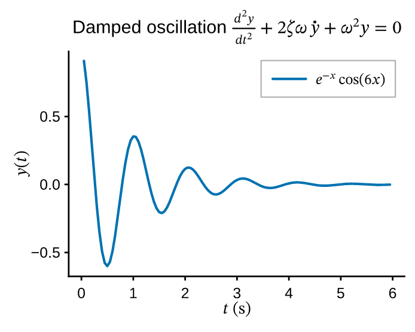
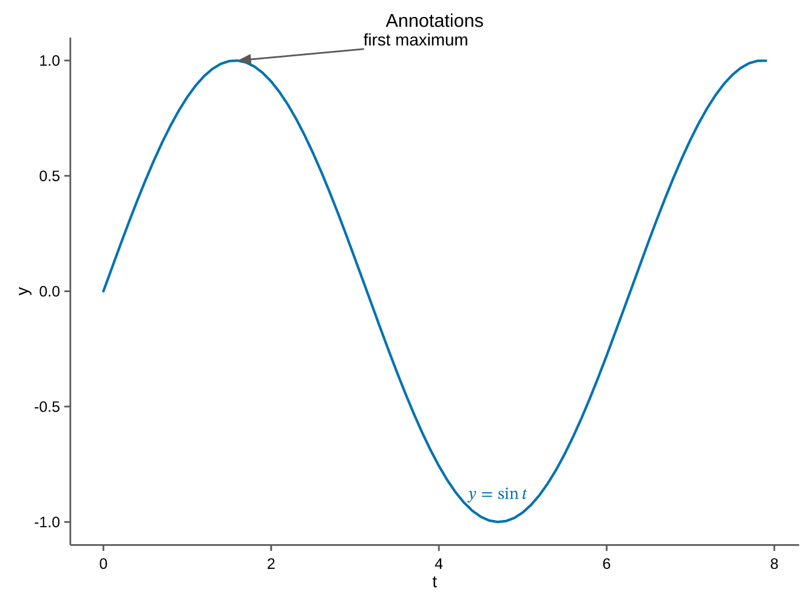

# Math & annotations

## LaTeX math

Any text — titles, axis labels, tick labels, legend entries, annotations — may
contain `$...$` math. It is typeset by a faithful, MathJax-grade engine driven by
the math font's OpenType MATH table, and **stays real, selectable text** in the
PDF/SVG output (copy-paste yields the Unicode math).

```python
--8<-- "examples/math_labels.py"
```

{ width="340" }

Supported syntax includes:

- super/subscripts `^` `_` (and both on one nucleus, `x_0^2`);
- `{...}` grouping;
- `\frac{a}{b}`, `\binom{n}{k}`;
- `\sqrt{...}` and `\sqrt[n]{...}` (a stretchy radical);
- auto-sized `\left...\right` fences;
- a broad Greek / operator / relation / arrow table (`\alpha`, `\sum`, `\int`,
  `\leq`, `\to`, `\infty`, `\partial`, …);
- accents `\hat`, `\bar`, `\vec`, `\tilde`, `\dot`, `\ddot`, …;
- math alphabets `\mathbf`, `\mathit`, `\mathbb`, `\mathcal`, `\mathfrak`,
  `\mathsf`, `\mathtt`, …;
- `\text{...}` and `\operatorname{...}` for upright runs.

!!! tip "Raw strings"
    Write math labels as raw strings (`r"$\alpha$"`) so Python doesn't interpret
    the backslashes.

When you save to **HTML** and a label contains `$...$`, the math is re-rendered
by an inlined copy of MathJax (SVG output), so it stays selectable and you can
right-click → *Show Math As* to copy the LaTeX/MathML — fully offline.

Math in a **tick label** works too, which is how a log axis writes its decades
as `$10^{k}$` — see [`LogFormatter`][pyplotrs.ticker.LogFormatter].

## Text annotations

[`text`][pyplotrs.axes.Axes.text] draws a string at data coordinates:

```python
ax.text(2.5, 0.8, r"region of interest", ha="center", color="C1")
ax.text(0.1, 0.9, "N = 42", weight="bold", style="italic", fontsize=8)
ax.text(0.5, 0.5, "sideways", rotation=90)
```

| Argument | Meaning |
|---|---|
| `ha` | `left` (default) / `center` / `right` |
| `va` | `baseline` (default) / `bottom` / `center` / `top` |
| `color` | defaults to the theme's text color |
| `fontsize` | in points; defaults to the theme's label size |
| `weight`, `style` | `normal`/`bold` and `normal`/`italic` — a **real face**, not a synthetic slant |
| `rotation` | degrees counter-clockwise about the anchor |

Rotation is applied as a group transform in the output rather than baked into
paths, so rotated text stays selectable in PDF and SVG.

## Callout arrows

[`annotate`][pyplotrs.axes.Axes.annotate] points text at a data location,
optionally with an arrow from the text to the point:

```python
--8<-- "examples/annotations.py"
```

{ width="340" }

`xy` is the point being annotated and `xytext` is where the label sits (defaults
to `xy`). Set `arrow=False` for a plain floating label. Both coordinates are in
data space, the same `ha`/`va`/`weight`/`style`/`rotation` arguments apply, and
the text may itself contain `$...$` math.

!!! tip "Annotations do not move the view"
    Text and callouts are drawn over the data and take no part in autoscaling,
    so a label placed outside the data range will be clipped rather than
    stretching the axes to fit. Set `xlim`/`ylim` if you need room for it.
