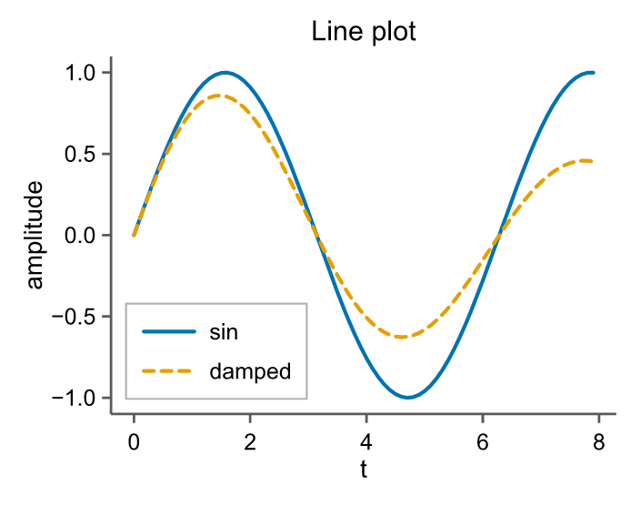
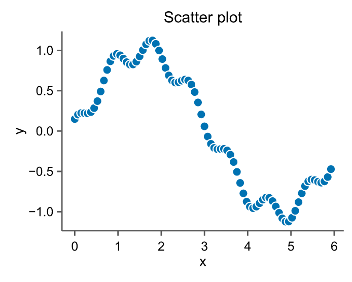
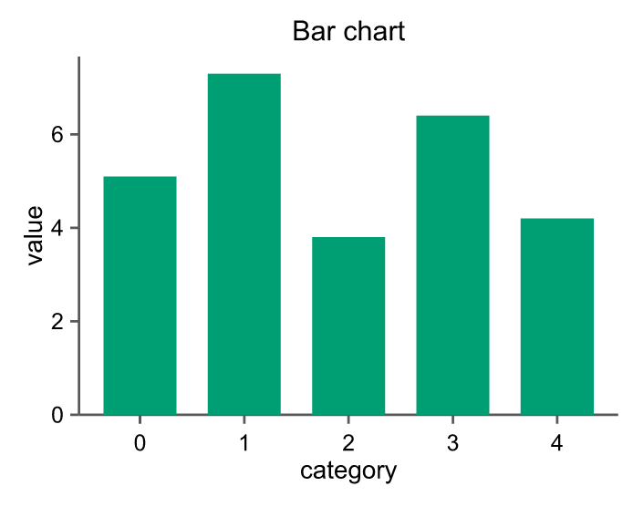
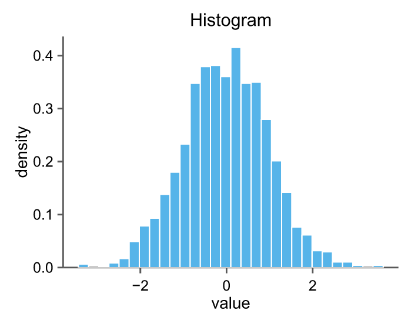
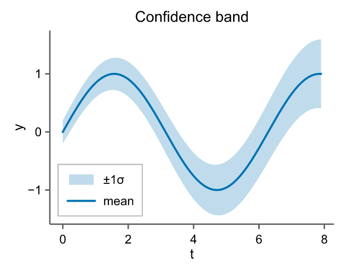
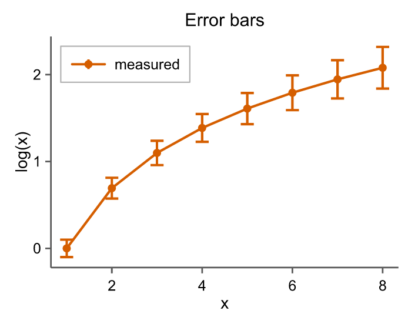
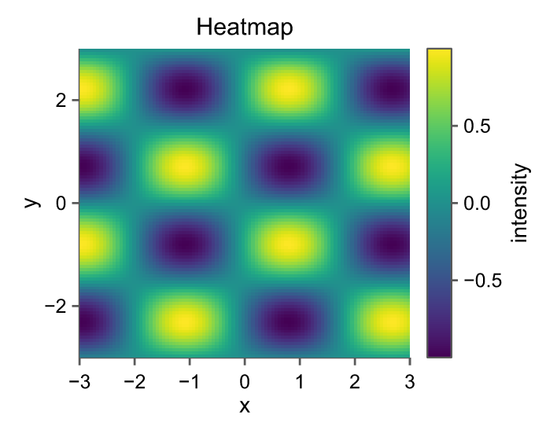
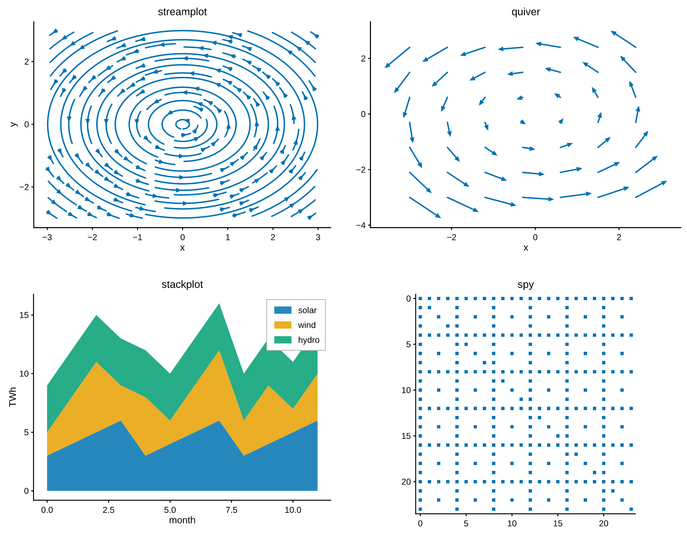

# Plot types

Every 2D mark is a method on [`Axes`][pyplotrs.axes.Axes]. They share a few
conventions:

- `color` may be `None` (cycle the palette), a `"C0".."C7"` palette index, or an
  `(r, g, b)` / `(r, g, b, a)` byte tuple.
- `label=` registers the mark in the legend.
- Calls return the axes, so they chain.

## Line

[`line`][pyplotrs.axes.Axes.line] plots a polyline. `linestyle` is one of
`solid`, `dashed`, `dotted`, `dashdot` (or `none` for markers only); an optional
`marker` draws a glyph at each vertex.

```python
--8<-- "examples/line.py"
```

{ width="340" }

!!! tip "Dense data"
    `line` collapses runs of near-collinear vertices in device space by default
    (`simplify=True`) — visually identical output, far smaller and faster vector
    files on large data. Pass `simplify=False` to keep every vertex exactly.

## Scatter

[`scatter`][pyplotrs.axes.Axes.scatter] places markers. `markersize` is the
marker **diameter in points** — the same unit `line(marker=..., markersize=...)`
uses, so the same number means the same size everywhere. `size` is also accepted
and means the **area** in pt², matching matplotlib's `s`, so `size=36` and
`markersize=6` agree. Marker shapes: `o` `s` `^` `v` `D` (filled) and `+` `x`
(stroked).

```python
--8<-- "examples/scatter.py"
```

{ width="340" }

## Bar

[`bar`][pyplotrs.axes.Axes.bar] draws vertical bars. The y-range is forced to
include the 0 baseline when all heights are non-negative.

```python
--8<-- "examples/bar.py"
```

{ width="340" }

## Histogram

[`hist`][pyplotrs.axes.Axes.hist] bins data into equal-width bins. Use
`density=True` to normalize to a probability density, and `range=(lo, hi)` to fix
the binning extent.

```python
--8<-- "examples/histogram.py"
```

{ width="340" }

## Fill between

[`fill_between`][pyplotrs.axes.Axes.fill_between] shades the band between two
curves (or a curve and a constant) — ideal for confidence intervals. `alpha`
controls transparency.

```python
--8<-- "examples/fill_between.py"
```

{ width="340" }

## Error bars

[`errorbar`][pyplotrs.axes.Axes.errorbar] draws symmetric `yerr`/`xerr` bars
with caps, optionally connected by a line and decorated with markers.

```python
--8<-- "examples/errorbar.py"
```

{ width="340" }

## Images & heatmaps

[`imshow`][pyplotrs.axes.Axes.imshow] displays a 2D field as a colormapped
image and returns a handle you can pass to
[`Figure.colorbar`][pyplotrs.figure.Figure.colorbar]. See
[colormaps & images](colormaps-and-images.md) for the full story.

```python
--8<-- "examples/heatmap.py"
```

{ width="340" }

## More plot types

Beyond the marks above, `Axes` also has:

| Method | What it draws |
|---|---|
| `step(xs, ys, where=...)` | Step plot; `where` is `"pre"`/`"post"`/`"mid"` |
| `stairs(values, edges=None, fill=False)` | Step outline over bin edges |
| `stem(xs, ys, bottom=0)` | Stems from a baseline, topped with markers |
| `broken_barh(xranges, yrange)` | Interval / Gantt bars |
| `eventplot(positions)` | Raster of event marks |
| `hist2d(xs, ys, bins=...)` | 2D histogram as a colormapped image |
| `hexbin(xs, ys, gridsize=...)` | Hexagonal binning coloured by count |
| `pcolormesh(C)` or `pcolormesh(X, Y, C)` | Pseudocolour grid |
| `contour(Z)` / `contourf(Z)` | Contour lines / filled bands |
| `hlines(y, xmin, xmax)` / `vlines(x, ymin, ymax)` | Data-coordinate segments |
| `fill_betweenx(ys, x1, x2)` | The transpose of `fill_between` |
| `fill(x, y)` | Filled polygon through `(x, y)` |
| `quiver(x, y, u, v)` | Arrow field |
| `streamplot(x, y, u, v)` | Streamlines of a vector field, RK4-integrated |
| `stackplot(x, *ys)` | Stacked area plot |
| `matshow(data)` | `imshow` with matrix conventions (origin top-left, equal aspect) |
| `spy(data)` | Sparsity pattern: a marker at each nonzero entry |
| `pcolor(C)` | Alias of `pcolormesh` |
| `loglog` / `semilogx` / `semilogy` | `line` with one or both axes log-scaled |

The binning, marching-squares and band-fill kernels all run in Rust. `hist2d`,
`hexbin`, `pcolormesh` and `contourf` return a handle for
[`Figure.colorbar`](../api/figure.md).

```python
--8<-- "examples/fields.py"
```

{ width="640" }

!!! tip "`hlines` vs `axhline`"
    `hlines` takes **data** coordinates and participates in autoscaling;
    `axhline` spans a fraction of the axes and is a guide that never moves the
    view. Reach for `axhline` to mark a threshold, `hlines` to plot data.
