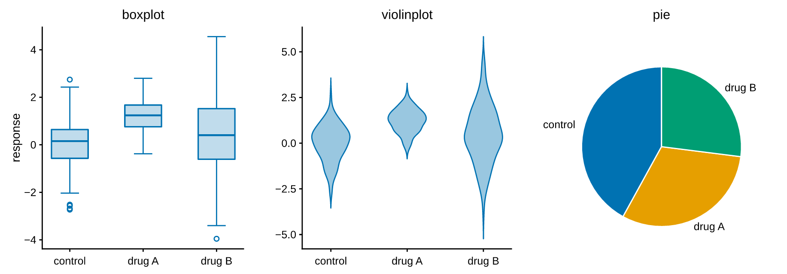

# Plot types

Every 2D mark is a method on [`Axes`][pyplotrs.axes.Axes]. They share a few
conventions:

- `color` may be `None` (cycle the theme palette), a `"C0".."Cn"` palette index,
  a CSS name, hex, or an `(r, g, b[, a])` tuple.
- `label=` registers the mark in the legend.
- `alpha=` and `zorder=` work on every mark.
- Calls return the axes, so they chain. The `imshow` family returns a colorbar
  handle instead.

## Lines & points

### Line

[`line`][pyplotrs.axes.Axes.line] plots a polyline. `linestyle` is one of
`solid`, `dashed`, `dotted`, `dashdot` (or `none` for markers only); an optional
`marker` draws a glyph at each vertex.

```python
--8<-- "examples/line.py"
```

{ width="340" }

!!! tip "Dense data"
    `line` collapses runs of near-collinear vertices in device space by default
    (`simplify=True`) — visually identical output, far smaller and faster vector
    files on large data. Pass `simplify=False` to keep every vertex exactly.

### Scatter

[`scatter`][pyplotrs.axes.Axes.scatter] places markers. `markersize` is the
marker **diameter in points** — the same unit `line(marker=..., markersize=...)`
uses, so the same number means the same size everywhere. `size` is also accepted
and means the **area** in pt², matching matplotlib's `s`, so `size=36` and
`markersize=6` agree. Marker shapes: `o` `s` `^` `v` `D` (filled) and `+` `x`
(stroked).

```python
--8<-- "examples/scatter.py"
```

{ width="340" }

Pass `c=` (a per-point array) to color markers by value through `cmap`/`norm`;
the call then returns a handle for [`Figure.colorbar`][pyplotrs.Figure.colorbar].

### Steps & stems

| Method | What it draws |
|---|---|
| `step(xs, ys, where="pre"/"post"/"mid")` | Step plot |
| `stairs(values, edges=None, fill=False)` | Step outline over bin edges |
| `stem(xs, ys, bottom=0)` | Stems from a baseline, topped with markers |

### Log-scaled shortcuts

`loglog`, `semilogx` and `semilogy` draw a line and set the corresponding scale
in one call. See [scales & ticks](scales-and-ticks.md).

## Bars & categories

[`bar`][pyplotrs.axes.Axes.bar] draws vertical bars;
[`barh`][pyplotrs.axes.Axes.barh] horizontal ones. The value axis is forced to
include the 0 baseline when all values are non-negative, and **string positions
give a categorical axis**:

```python
ax.bar(["ash", "birch", "cedar"], [12, 19, 7])
```

```python
--8<-- "examples/bar.py"
```

{ width="340" }

`width` (on `bar`) and `height` (on `barh`) are extents in **data units**, not
stroke widths. `bottom`/`left` offset the baseline, which is how stacked bars
are built.

Related: `broken_barh(xranges, yrange)` for interval/Gantt bars, and
`eventplot(positions)` for a raster of event marks.

## Distributions

### Histogram

[`hist`][pyplotrs.axes.Axes.hist] bins data into equal-width bins. Use
`density=True` to normalize to a probability density, and `range=(lo, hi)` to fix
the binning extent.

```python
--8<-- "examples/histogram.py"
```

{ width="340" }

### Box, violin and pie

[`boxplot`][pyplotrs.axes.Axes.boxplot] draws a box-and-whisker per array
(`showfliers=False` drops the outlier points);
[`violinplot`][pyplotrs.axes.Axes.violinplot] draws a mirrored Gaussian-KDE
density — computed in Rust, so no SciPy dependency;
[`pie`][pyplotrs.axes.Axes.pie] draws an auto-normalized pie, turning the frame
off and fixing an equal aspect so the wedges stay circular.

```python
--8<-- "examples/statistical.py"
```

{ width="660" }

`pie` is the one mark with no scalar `label`: its labels are per wedge, so they
come from `labels=`, which is also what feeds `legend()`. The pie is fitted in
device space against its measured labels, so a long label shrinks the pie
instead of being clipped.

## Uncertainty & bands

### Fill between

[`fill_between`][pyplotrs.axes.Axes.fill_between] shades the band between two
curves (or a curve and a constant) — ideal for confidence intervals. `alpha`
controls transparency, and `fill_betweenx` is the transpose.

```python
--8<-- "examples/fill_between.py"
```

{ width="340" }

### Error bars

[`errorbar`][pyplotrs.axes.Axes.errorbar] draws symmetric `yerr`/`xerr` bars
with caps, optionally connected by a line and decorated with markers. Pass
`linestyle="none"` for markers and whiskers only.

```python
--8<-- "examples/errorbar.py"
```

{ width="340" }

### Stacked areas

`stackplot(x, *ys, labels=[...])` stacks series into filled bands.

## Fields, images & contours

[`imshow`][pyplotrs.axes.Axes.imshow] displays a 2D field as a colormapped image
and returns a handle you can pass to
[`Figure.colorbar`][pyplotrs.Figure.colorbar]. See
[colormaps & images](colormaps-and-images.md) for the full story.

```python
--8<-- "examples/heatmap.py"
```

{ width="340" }

| Method | What it draws |
|---|---|
| `imshow(data)` | Colormapped image of a 2D array |
| `matshow(data)` | `imshow` with matrix conventions (origin top-left, equal aspect) |
| `spy(data)` | Sparsity pattern: a marker at each nonzero entry |
| `pcolormesh(C)` or `pcolormesh(X, Y, C)` | Pseudocolor grid (`pcolor` is an alias) |
| `hist2d(xs, ys, bins=...)` | 2D histogram as a colormapped image |
| `hexbin(xs, ys, gridsize=...)` | Hexagonal binning colored by count |
| `contour(Z)` / `contourf(Z)` | Contour lines / filled bands |
| `quiver(x, y, u, v)` | Arrow field |
| `streamplot(x, y, u, v)` | Streamlines of a vector field, RK4-integrated |

```python
--8<-- "examples/fields.py"
```

{ width="640" }

The binning, marching-squares and band-fill kernels all run in Rust. `hist2d`,
`hexbin`, `pcolormesh`, `contourf` and the colormapped `scatter` all return a
handle for [`Figure.colorbar`](../api/figure.md).

!!! note "`contour` levels are a hint"
    `contour(levels=7)` asks for *about* seven lines and puts them on multiples
    of a round step, the way matplotlib does, rather than slicing the data range
    into equal parts. `contourf` fills the bands of that same lattice, so lines
    drawn over fills of the same field land on band boundaries — which also
    means the outermost bands reach a little past the data, out to the round
    numbers.

## Guides & shapes

Guides are drawn over the data and **never affect autoscaling** — they mark a
threshold rather than plotting one.

| Method | What it draws |
|---|---|
| `axhline(y)` / `axvline(x)` | Reference line across a fraction of the axes |
| `axhspan(ymin, ymax)` / `axvspan(xmin, xmax)` | Shaded band, drawn behind the data |
| `axline(xy1, xy2=/slope=)` | Infinite line, clipped to the plot rect |
| `hlines(y, xmin, xmax)` / `vlines(x, ymin, ymax)` | **Data**-coordinate segments that *do* autoscale |

!!! tip "`hlines` vs `axhline`"
    `hlines` takes data coordinates and participates in autoscaling; `axhline`
    spans a fraction of the axes and never moves the view. Reach for `axhline`
    to mark a threshold, `hlines` to plot data.

Patches are shapes in data space, with `facecolor` / `edgecolor` / `linewidth` /
`linestyle` / `alpha` / `fill` / `hatch`:

| Method | What it draws |
|---|---|
| `rectangle(xy, width, height, angle=0)` | Rectangle from its lower-left corner |
| `circle(xy, radius)` | Circle (an ellipse unless the aspect is equal) |
| `ellipse(xy, width, height, angle=0)` | Ellipse from its full diameters |
| `polygon(points)` | Polygon through data-space vertices |
| `fill(x, y)` | The same, from parallel `x`/`y` arrays |
| `arrow(x, y, dx, dy)` | Arrow from `(x, y)` to `(x + dx, y + dy)` |

## Layering

Marks draw in the order you add them, which is usually all the control you need
and the one thing you can read straight off the code. When something has to sit
above a mark added *after* it, give it a higher `zorder`:

```python
ax.line(xs, ys, zorder=2)              # drawn last despite being added first
ax.fill_between(xs, ys, 0, zorder=1)
```

Ties keep insertion order, so setting `zorder` on one mark does not reshuffle
the rest. Guides and patches always draw above the data marks.

## Other axes kinds

`Axes` is the Cartesian 2D vocabulary. [Polar](polar.md) and [3D](3d.md) axes
have their own — reach for them with `projection="polar"` / `projection="3d"`.
