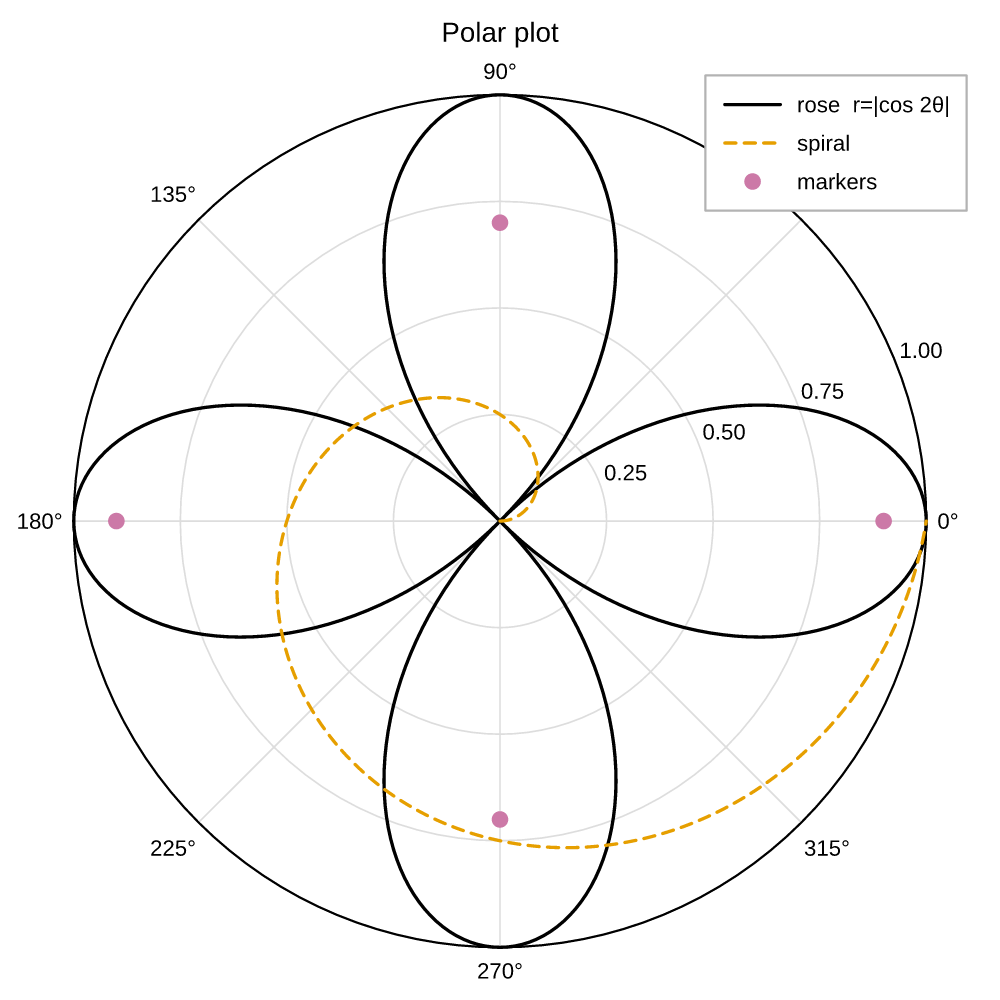

# Polar plots

A polar axes draws `(theta, r)` on a circular frame. Ask for one with
`projection="polar"`, on `subplots` or on a single `add_subplot` cell:

```python
fig, ax = plt.subplots(projection="polar")
fig, ax = plt.subplots(1, 2, projection="polar")   # every panel polar
ax = fig.add_subplot(gs[1, 1], projection="polar") # one polar panel in a grid
```

```python
--8<-- "examples/polar.py"
```

{ width="380" }

## Marks

A [`PolarAxes`][pyplotrs.polar.PolarAxes] carries two marks —
[`plot`][pyplotrs.polar.PolarAxes.plot] and
[`scatter`][pyplotrs.polar.PolarAxes.scatter] — with the same styling arguments
as their Cartesian counterparts (`color`, `linewidth`, `linestyle`, `marker`,
`markersize`, `alpha`, `label`, `zorder`):

```python
ax.plot(theta, r, label="response", linestyle="dashed")
ax.scatter(theta, r, color="C3", markersize=4, label="peaks")
ax.legend(loc="upper right")
```

**Angles are in radians**, counter-clockwise from the positive x-axis (East) —
matplotlib's convention. Convert on the way in if your data is in degrees:

```python
theta = [math.radians(d) for d in degrees]
```

## The dial

[`set`][pyplotrs.polar.PolarAxes.set] configures the frame:

```python
ax.set(
    title="Antenna pattern",
    rmin=0, rmax=1,                 # radial limits
    rticks=[0.25, 0.5, 0.75, 1.0],  # radial gridline positions
    thetagrids=[0, 45, 90, 135, 180, 225, 270, 315],  # spokes, in degrees
    theta_zero_location="N",        # what sits at theta = 0
    theta_direction=-1,             # clockwise
    rlabel_position=22.5,           # angle the radial labels sit along
)
```

Note the asymmetry, which follows matplotlib: `thetagrids` and
`rlabel_position` are in **degrees** (they are chrome positions you read off a
protractor), while the *data* is in radians.

`theta_zero_location` takes `"E"` (default), `"N"`, `"W"`, `"S"`, or an angle in
radians. `theta_direction` is `1` for counter-clockwise (default) or `-1` /
`"clockwise"` / `"cw"`.

A compass-style dial — north at the top, clockwise, degrees on the rim — is
therefore:

```python
ax.set(theta_zero_location="N", theta_direction=-1)
```

## Reading it back

```python
ax.get_rlim()             # effective (rmin, rmax) — the data range if not pinned
ax.get_rticks()           # located radial ticks
ax.get_thetagrids()       # spoke angles, degrees
ax.get_theta_direction()  # 1 or -1
```

## What a polar axes does not have

It is a circular frame, not a Cartesian one, so there is no `xlabel`/`ylabel`,
no `xlim`, and no Cartesian mark vocabulary (`bar`, `imshow`, …) on it. Legends,
themes, `$...$` math in the title and labels, and every output format work
exactly as they do elsewhere — including figure-level legends, which collect
polar panels along with the rest.
