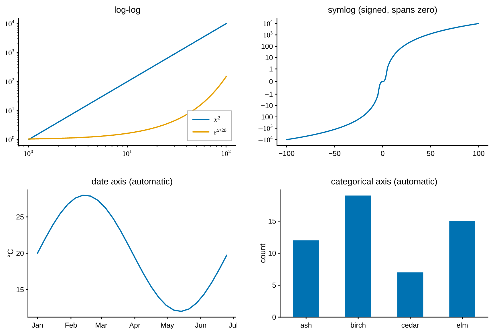

# Scales & ticks

Everything on this page is an argument to [`set`][pyplotrs.axes.Axes.set]. There
is no `set_xscale`/`set_xlim`/`set_xticks` family — one method writes an axes,
and the `get_*` accessors read it back.

```python
--8<-- "examples/scales.py"
```

{ width="620" }

## Axis scales

`xscale` / `yscale` take a name or a [`Scale`][pyplotrs.scales.Scale] instance:

| Name | What it does |
|---|---|
| `"linear"` | The default. |
| `"log"` | Base-10. Non-positive data becomes a gap, as in matplotlib. Ticks are decades, labeled `$10^{k}$` as real math. |
| `"symlog"` | Linear within ±1, logarithmic beyond — for signed data that crosses zero. |
| `"logit"` | `log10(p / (1 - p))`, for probabilities in (0, 1). Gridlines at 0.001 … 0.999. |
| `"date"` | A time axis over day numbers; usually selected for you (see below). |

```python
ax.set(xscale="log", yscale="log")
```

`loglog`, `semilogx` and `semilogy` are convenience wrappers that draw a line
and set the scale in one call:

```python
ax.loglog(xs, ys)          # == ax.line(xs, ys); ax.set(xscale="log", yscale="log")
```

The transform runs **per point in Rust**, so a nonlinear axis costs no Python
per point — the same fast path a linear axis takes.

## Scales the data chooses

Two input types select their own scale, so the common cases need no arguments
at all:

```python
from datetime import date

ax.line([date(2026, 1, 1), date(2026, 2, 1), date(2026, 3, 1)], [3, 5, 4])
ax.bar(["ash", "birch", "cedar"], [12, 19, 7])
```

- **Datetimes** (`datetime`, `date`, or anything datetime-like) switch that axis
  to a [`DateScale`][pyplotrs.scales.DateScale]: values are converted to day
  numbers via [`date2num`][pyplotrs.scales.date2num], and ticks land on calendar
  boundaries — year, month, day or hour — chosen from the visible span.
- **Strings** switch it to a
  [`CategoricalScale`][pyplotrs.scales.CategoricalScale]: each distinct label
  takes an integer position in first-seen order, one tick per category, with the
  view spanning `-0.5 … n-0.5`.

Mixing the two on one axis is not meaningful; the last kind of data wins.

## Limits, margins and direction

```python
ax.set(xlim=(0, 10), ylim=(-1, 1))   # pin
ax.set(xlim="auto")                  # release a pinned limit back to autoscale
ax.set(margin=0)                     # limits tight to the data
ax.set(ymargin=0.2)                  # 20% padding on y only
ax.set(yinverted=True)               # y descends, and still autoscales
```

`None` means "leave alone", so it cannot double as a reset — that is what
`"auto"` is for. Autoscaling pads the data range by 5% on each side by default;
`xmargin`/`ymargin` (or `margin` for both) replace that fraction, on every scale
— on a log axis the padding is 5% of the *decade* span, so it looks the same at
both ends. A margin of -0.5 or below is rejected: it would collapse or invert
the axis.

The padding stops where a mark **rests on** a value rather than merely reaching
it — a stacked area's floor, a bar's base, an image's extent — so those marks sit
flush against the spine instead of floating above it. It is per mark and per
direction, so a line drawn past an image still gets its own margin. A mark that
merely stops somewhere keeps the padding: `fill_between(x, y, 0)` is padded
below zero, because there 0 is just another curve.

`yinverted` flips the direction without pinning numbers, which is what you want
for depth profiles or image-like axes that must keep autoscaling. Non-finite
values (`NaN`/`inf`) never take part in autoscaling.

`aspect="equal"` equalizes the data-unit scale on both axes (`"auto"` releases
it), and `axis("off")` drops the whole frame — spines, ticks and grid:

```python
ax.set(aspect="equal")
ax.axis("off")
```

## Ticks

```python
ax.set(xticks=[0, 1, 2, 3])                      # pin positions
ax.set(xticks=[0, 1, 2], xticklabels=["a", "b", "c"])
ax.set(xticklabels=[])                           # keep ticks, blank the labels
ax.set(yminor=4)                                 # 4 minor intervals per major
ax.set(tick_direction="in", tick_length=4)
```

Left alone, the locator picks "nice numbers" — multiples of 1, 2 or 5 times a
power of ten — so ticks land on values a reader can do arithmetic with. Pinned
positions that fall outside the view are dropped rather than drawn beyond the
panel. `xminor`/`yminor` (or `minor`) apply to linear axes; log, symlog and logit
axes already subdivide themselves.

Reading back always reports what will actually be drawn:

```python
ax.get_xticks()        # [0.0, 2.0, 4.0, 6.0, 8.0]
ax.get_xticklabels()   # ['0', '2', '4', '6', '8']
ax.get_xscale()        # 'linear'
```

## Formatters

`xformatter` / `yformatter` accept a [`Formatter`][pyplotrs.ticker.Formatter], a
`"{x:.2f}"` template string, or any callable — the locator still picks *where*
the ticks go, the formatter decides how each is written:

```python
from pyplotrs import ticker

ax.set(yformatter="{x:.1f}")
ax.set(yformatter=ticker.PercentFormatter(xmax=1.0))
ax.set(xformatter=ticker.EngFormatter(unit="Hz"))
ax.set(xformatter=ticker.DateFormatter("%b %Y"))
ax.set(yformatter=lambda v, pos: "hi" if v > 0 else "lo")
```

| Formatter | Writes |
|---|---|
| [`ScalarFormatter`][pyplotrs.ticker.ScalarFormatter] | Plain decimals; `scientific=True` switches to mantissa/exponent outside a range |
| [`StrMethodFormatter`][pyplotrs.ticker.StrMethodFormatter] | `fmt.format(x=value, pos=pos)`, e.g. `"{x:.2f}"` |
| [`FuncFormatter`][pyplotrs.ticker.FuncFormatter] | Whatever `func(value, pos)` returns |
| [`FixedFormatter`][pyplotrs.ticker.FixedFormatter] | Labels from a fixed list by index — what backs `xticklabels=` |
| [`PercentFormatter`][pyplotrs.ticker.PercentFormatter] | `value / xmax * 100` plus a symbol |
| [`EngFormatter`][pyplotrs.ticker.EngFormatter] | Engineering notation with an SI prefix (`k`, `M`, `m`, `µ`) |
| [`LogFormatter`][pyplotrs.ticker.LogFormatter] | Decades as `$10^{k}$` math |
| [`DateFormatter`][pyplotrs.ticker.DateFormatter] | `strftime` patterns over day numbers |

A label may contain `$...$` math — `LogFormatter` relies on it — and it flows
through the same editable-text pipeline as every other label.

### The minus sign

Formatters that render a *number* sign it with **U+2212 MINUS SIGN** (`−2`),
not the ASCII hyphen (`-2`), so a column of negative tick labels stays aligned
and matches what `$...$` math has always drawn. Formatters that hand back a
string you supplied — `FixedFormatter`, `FuncFormatter`, `StrMethodFormatter`,
`DateFormatter` — pass it through untouched, so `"%Y-%m-%d"` keeps its hyphens.
Turn the substitution off globally with `plt.set_unicode_minus(False)`; see
[styling & themes](styling-and-themes.md#the-minus-sign).

## Grids

The grid is a theme choice, overridable per axes:

```python
ax.set(grid=True)
mine = plt.themes.default.with_(grid=True, grid_color=(220, 220, 220, 255))
```

## Color scales: norms

The colormap equivalent of a scale is a
[`Normalize`][pyplotrs.norms.Normalize], which maps data values into `[0, 1]`
for lookup. Pass one to `imshow`, a colormapped `scatter`, or the field marks:

```python
from pyplotrs import norms

ax.imshow(data, cmap="magma", norm=norms.LogNorm())
ax.imshow(data, cmap="RdBu", norm=norms.TwoSlopeNorm(vcenter=0.0))
ax.scatter(xs, ys, c=counts, norm="log")
```

| Norm | For |
|---|---|
| [`Normalize`][pyplotrs.norms.Normalize] | Linear between `vmin` and `vmax` (the default) |
| [`LogNorm`][pyplotrs.norms.LogNorm] | Positive data spanning decades |
| [`TwoSlopeNorm`][pyplotrs.norms.TwoSlopeNorm] | Diverging data pinned about a center |
| [`BoundaryNorm`][pyplotrs.norms.BoundaryNorm] | Discrete bands from explicit boundaries |

A colorbar follows its mappable's norm, so a `LogNorm` image gets log-spaced
colorbar ticks without further arrangement.
