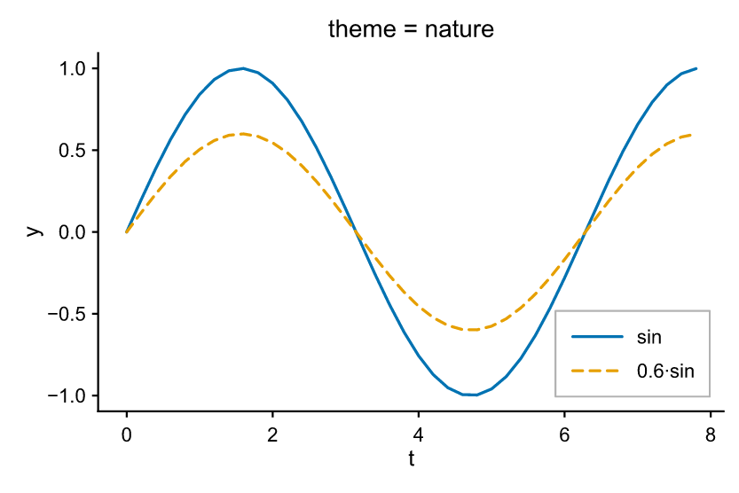
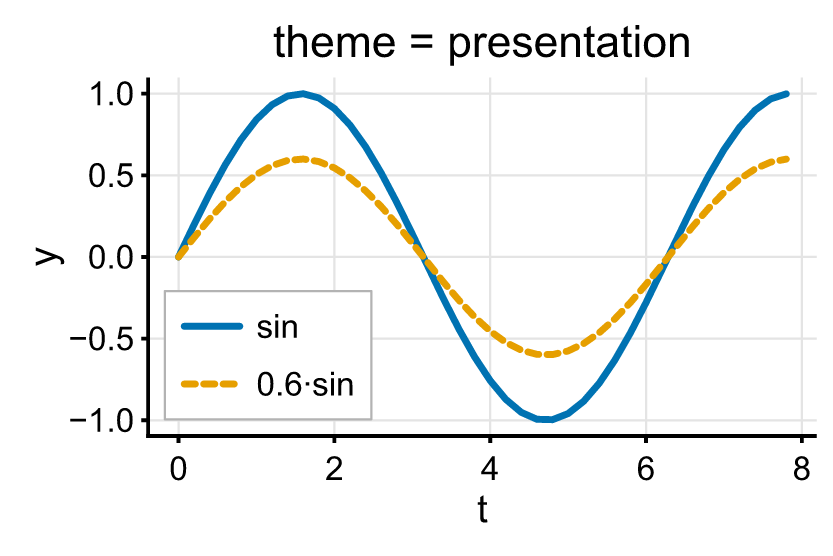

# Styling & themes

## Themes

A [`Theme`][pyplotrs.theme.Theme] bundles every *style* choice — palette, type
scale, spines, grid, default line weights, legend colors. There is **no global
"current theme"**: you pass a theme to `subplots` (or `Figure`) and it flows to
every axes.

```python
import pyplotrs as pp

fig, ax = pp.subplots(theme="presentation")
ax.line(xs, ys)
```

Built-in presets (pass the name, or `pyplotrs.themes.<name>`):

| Preset | For |
|---|---|
| `default` | The zero-config publication default (Okabe-Ito palette, despined, no grid) |
| `nature` | Compact: smaller type and thinner rules for dense two-column figures |
| `grayscale` (alias `bw`) | Print-safe monochrome palette with black spines/text |
| `presentation` | Large type, heavy strokes and a light grid, tuned for slides |

```python
--8<-- "examples/themes.py"
```

<div class="grid" markdown>




</div>

## Deriving your own theme

`Theme` is an immutable dataclass; [`with_`][pyplotrs.theme.Theme.with_] returns
a copy with changes applied:

```python
import pyplotrs as pp

mine = pp.themes.default.with_(
    grid=True,
    line_width=2.0,
    axes_facecolor=(248, 248, 248, 255),
)
fig, ax = pp.subplots(theme=mine)
```

Because a theme is a value rather than global config, two figures in the same
script — or the same thread pool — can use different ones without interfering.

### Every field

| Field | Default | Controls |
|---|---|---|
| `palette` | Okabe-Ito | The cycling color sequence `"C0".."Cn"` indexes |
| `text_color` | black | Titles, labels, tick labels, annotations |
| `spine_color` | black | Axis lines and tick marks |
| `spines` | `("left", "bottom")` | Which spines (and their ticks) to draw |
| `spine_width` | `1.0` | Spine stroke width |
| `spine_join` | `"miter"` | How a spine finishes where another abuts it: `"miter"`, `"square"`, `"butt"` |
| `tick_label_size` | `9.0` | Type scale, in points |
| `axis_label_size` | `10.0` | " |
| `title_size` | `11.0` | " |
| `suptitle_size` | `13.0` | " |
| `legend_size` | `9.0` | " |
| `title_weight` | `"normal"` | `"normal"` or `"bold"` chrome weight |
| `suptitle_weight` | `"normal"` | " |
| `axis_label_weight` | `"normal"` | " |
| `line_width` | `1.5` | Default stroke width of a `line` mark |
| `grid` | `False` | Draw gridlines |
| `grid_color` | light gray | " |
| `grid_width` | `0.6` | " |
| `axes_facecolor` | `None` | Plot-area background fill (`None` = transparent) |
| `legend_facecolor` | white | Legend box fill |
| `legend_edgecolor` | gray | Legend box border |

A theme also derives `separator_color` — the hairline between adjacent filled
shapes such as histogram bins and pie wedges — from `axes_facecolor`, so those
seams read as "the background showing through" whatever the background is.

## Colors

Anywhere a `color=` is accepted you can give:

- `None` — take the next color from the theme palette (auto-cycling);
- `"C0" … "Cn"` — an index into *this theme's* palette (so `"C3"` follows the
  active theme, not a fixed global color);
- a CSS/matplotlib color name — `"steelblue"`, `"red"` (case-insensitive);
- hex — `"#f80"`, `"#ff8800"`, `"#ff8800cc"`;
- `(r, g, b)` or `(r, g, b, a)` — literal bytes in `0–255`;
- an all-float tuple in `0–1` — matplotlib's convention, scaled for you.

```python
ax.line(xs, ys, color="C2")                     # third palette color
ax.line(xs, ys, color=(214, 39, 40))            # literal RGB bytes
ax.scatter(xs, ys, color=(31, 119, 180, 128))   # semi-transparent
```

The default palette is **Okabe-Ito**, a colorblind-safe categorical set. Swap in
any of the [built-in palettes](colormaps-and-images.md#categorical-palettes):

```python
mine = pp.themes.default.with_(palette=pp.palettes.get("tab10"))
```

## Fonts

For body text pyplotrs prefers the host's **Arial**, then **Helvetica**, before
falling back to the bundled **Liberation Sans** (Arial-metric-compatible). It is
matplotlib's `font.sans-serif` behavior, and configurable:

```python
import pyplotrs as pp

pp.set_font_family("Calibri", "Arial")     # try Calibri, then Arial, then fallback
pp.get_font_family()                       # the current preference list
pp.resolved_font_name()                    # what it actually resolves to here
pp.set_font_family()                       # reset to the default
```

Whichever font is chosen is **embedded into every saved figure** (PDF/SVG/PNG and
the 3D-HTML viewer), so a file saved on one machine looks identical when opened
on another — the font choice only affects how that one rendering looks, never its
portability. Arial and Helvetica are proprietary and are *never* bundled; they
are only used when already installed on the machine.

### Bold and italic

Free text takes `weight` (`"normal"`/`"bold"`) and `style`
(`"normal"`/`"italic"`), which select a **real face** of the family rather than
synthetically slanting or smearing the regular one:

```python
ax.text(0.1, 0.9, "emphasis", weight="bold", style="italic")
ax.annotate("callout", (1, 1), xytext=(1.2, 2), weight="bold")
```

The figure's own chrome is a theme choice, since bold panel titles are a
document-wide decision rather than a per-call one:

```python
journal = pp.themes.nature.with_(title_weight="bold")
fig, ax = pp.subplots(theme=journal)
```

Each face is embedded as its own subset, so a figure using all four carries four
subsetted fonts and every one stays selectable, editable text.

Font matching is approximate: a family with no italic face resolves to its
regular one, so text stays legible but is not slanted.
[`resolved_font_variants()`][pyplotrs.resolved_font_variants] reports what each
face landed on — two selectors reporting the same name means the host has no
distinct face for one of them:

```python
pp.resolved_font_variants()
# [('body', 'ArialMT'), ('body-bold', 'Arial-BoldMT'),
#  ('body-italic', 'Arial-ItalicMT'), ('body-bolditalic', 'Arial-BoldItalicMT')]
```

All four Liberation Sans faces are **bundled**, so emphasis works even on a
machine with no fonts installed at all — a slim container, a wheel builder — and
a figure looks the same wherever it is generated.

### The minus sign

Negative tick labels are signed with **U+2212 MINUS SIGN** (`−2`), not the ASCII
hyphen-minus (`-2`). The two are different characters: the hyphen is a short, low
word-joiner, while the minus is drawn on the math axis at the width of a `+` and
close to the width of a digit, so a column of tick labels stays aligned. It is
also what `$...$` math has always used, so a linear axis and a log axis' `$10^{-3}$`
read the same.

```python
pp.set_unicode_minus(False)   # back to ASCII "-"
pp.get_unicode_minus()        # the current setting
```

Turn it off if labels must survive being copied out of a saved SVG or PDF and
parsed back as numbers, or if a font you have set lacks the glyph. The setting
covers labels pyplotrs formats from a number — axis and colorbar ticks, and the
numeric `pyplotrs.ticker` formatters. Text you write yourself is never
rewritten, so `set(xticklabels=[...])`, a `FuncFormatter`, and
`DateFormatter("%Y-%m-%d")` all keep their hyphens.

## Layering

Marks draw in the order you add them, which is usually all the control you need
and is the one thing you can read straight off the code. When something has to
sit above a mark added *after* it, give it a higher `zorder`:

```python
ax.line(xs, ys, zorder=2)              # drawn last despite being added first
ax.fill_between(xs, ys, 0, zorder=1)
```

Ties keep insertion order, so setting `zorder` on one mark does not reshuffle
the rest. Reference lines (`axhline`, `axvline`, spans) and patches always draw
above the data marks.
