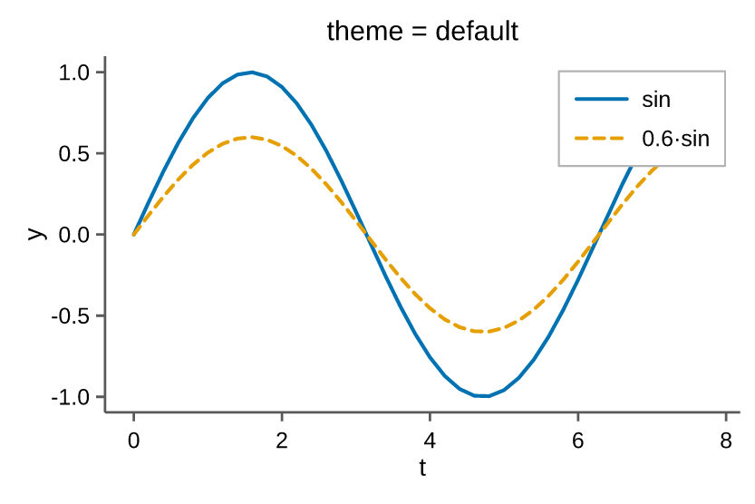
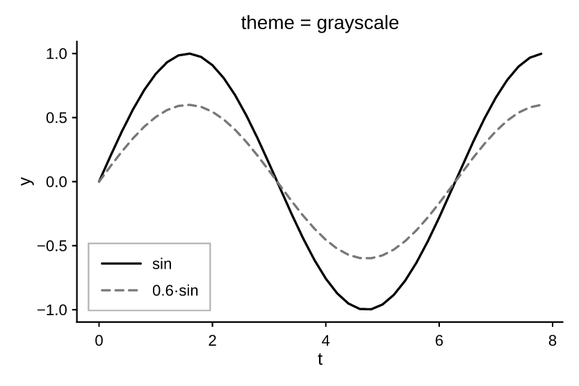
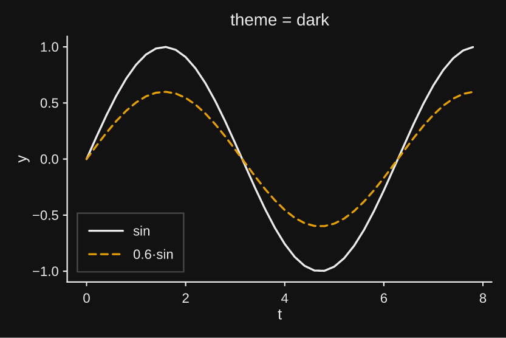

# Styling & themes

## Themes

A [`Theme`][pyplotrs.theme.Theme] bundles every *style* choice — palette, type
scale, spines, grid, default line weights, legend colors. There is **no global
"current theme"**: you pass a theme to `subplots` (or `Figure`) and it flows to
every axes.

```python
import pyplotrs as pp

fig, ax = pp.subplots(theme="dark")
ax.line(xs, ys)
```

Built-in presets (pass the name, or `pyplotrs.themes.<name>`):

| Preset | For |
|---|---|
| `default` | The zero-config publication default: Okabe-Ito palette, despined, no grid, compact type sized for a journal column |
| `grayscale` (alias `bw`) | `default` with the color taken out, for a monochrome press |
| `dark` | `default` with the ink and the paper swapped: near-black page, off-white type, palette re-aimed at a dark background |

```python
--8<-- "examples/themes.py"
```

<div class="grid" markdown>



</div>

All three share one type scale and one set of rules, so a figure keeps its
layout when you switch between them — only the color changes.

### The dark theme

`dark` states a page of its own (`figure_facecolor`), which no light theme does:
`.png` already fills its page white, and `.pdf`/`.svg`/`.html` deliberately
paint nothing so a figure drops onto whatever is behind it. White text over
"nothing" is white text on a white page in every viewer that opens it, so the
dark page is painted into every format alike.

Two consequences worth knowing:

```python
fig.save("plot.png", transparent=True)   # keeps the light ink, drops the page
```

`transparent=True` now means "no page" in *every* format, not just `.png` —
which is how you composite a dark figure onto a background of your own.

The palette is Okabe-Ito index for index, so `C3` is the same bluish green in
`default` and in `dark` and a figure keeps its series colors across the switch.
Only two entries moved. `C0` black becomes off-white, since black cannot be
lifted without becoming a different color — which keeps its meaning rather than
breaking it, because `C0` stands for "ink, no hue" and not for black in
particular. And Okabe-Ito's blue at `C5` reaches just 3.6:1 against the dark
page, so it is lifted in Oklch — hue held, chroma shrunk only as far as the
sRGB gamut demands — to the smallest lightness clearing 4.5:1.

The page is near-black rather than pure black, for the reason every dark UI
theme lands there: `#000` under white text glares, and on OLED it blooms around
the type. If you need true black — to sit seamlessly on a black slide, say:

```python
pp.subplots(theme=pp.themes.dark.with_(figure_facecolor=(0, 0, 0, 255)))
```

## Deriving your own theme

`Theme` is an immutable dataclass; [`with_`][pyplotrs.theme.Theme.with_] returns
a copy with changes applied:

```python
import pyplotrs as pp

mine = pp.themes.default.with_(
    grid=True,
    line_width=2.0,
    axes_facecolor=(248, 248, 248, 255),
)
fig, ax = pp.subplots(theme=mine)
```

Because a theme is a value rather than global config, two figures in the same
script — or the same thread pool — can use different ones without interfering.

### Every field

| Field | Default | Controls |
|---|---|---|
| `palette` | Okabe-Ito | The cycling color sequence `"C0".."Cn"` indexes |
| `text_color` | black | Titles, labels, tick labels, annotations |
| `spine_color` | black | Axis lines and tick marks |
| `spines` | `("left", "bottom")` | Which spines (and their ticks) to draw |
| `spine_width` | `0.8` | Spine stroke width |
| `spine_join` | `"miter"` | How a spine finishes where another abuts it: `"miter"`, `"square"`, `"butt"` |
| `tick_label_size` | `8.0` | Type scale, in points |
| `axis_label_size` | `9.0` | " |
| `title_size` | `10.0` | " |
| `suptitle_size` | `11.0` | " |
| `legend_size` | `8.0` | " |
| `title_weight` | `"normal"` | `"normal"` or `"bold"` chrome weight |
| `suptitle_weight` | `"normal"` | " |
| `axis_label_weight` | `"normal"` | " |
| `line_width` | `1.2` | Default stroke width of a `line` mark |
| `grid` | `False` | Draw gridlines |
| `grid_color` | light gray | " |
| `grid_width` | `0.6` | " |
| `figure_facecolor` | `None` | The page the whole figure sits on (`None` = paint none) |
| `axes_facecolor` | `None` | Plot-area background fill (`None` = transparent) |
| `legend_facecolor` | white | Legend box fill |
| `legend_edgecolor` | gray | Legend box border |

The type scale is calibrated for a figure printed at journal column width
(~3.3 in), where the page scales it down. Screen-first work usually wants a step
up — `default.with_(title_size=14, ...)`, or simply a larger `figsize`.

A theme also derives `separator_color` — the hairline between adjacent filled
shapes such as histogram bins and pie wedges — from `axes_facecolor`, then from
`figure_facecolor`, so those seams read as "the background showing through"
whatever the background is.

## Colors

Anywhere a `color=` is accepted you can give:

- `None` — take the next color from the theme palette (auto-cycling);
- `"C0" … "Cn"` — an index into *this theme's* palette (so `"C3"` follows the
  active theme, not a fixed global color);
- a CSS/matplotlib color name — `"steelblue"`, `"red"` (case-insensitive);
- hex — `"#f80"`, `"#ff8800"`, `"#ff8800cc"`;
- `(r, g, b)` or `(r, g, b, a)` — literal bytes in `0–255`;
- an all-float tuple in `0–1` — matplotlib's convention, scaled for you.

```python
ax.line(xs, ys, color="C2")                     # third palette color
ax.line(xs, ys, color=(214, 39, 40))            # literal RGB bytes
ax.scatter(xs, ys, color=(31, 119, 180, 128))   # semi-transparent
```

The default palette is **Okabe-Ito**, a colorblind-safe categorical set, in the
order Okabe and Ito published it. Two things follow from that order:

- **`C0` is black**, so a single unstyled line comes out in ink. A lone series
  has nothing to contrast against, so a hue on it encodes nothing — and black is
  also the entry that separates best from the other seven, which is why it earns
  the slot twice over. On `dark` it becomes the page's off-white.
- **`C4` is yellow**, which is only 1.32:1 against a white page. It reads well
  as a fill but is faint as a 1.2 pt line, so a five-line plot on the stock
  palette has one weak line. Skip past it with an explicit `color="C5"`, or
  reorder the palette in a derived theme.

!!! warning "Colorblind-safe is not grayscale-safe"

    Okabe-Ito separates on **hue**, and its lightnesses are close together:
    `C1` (orange) and `C2` (sky blue) are 0.8 L\* apart, below what any
    printing system can resolve. Two series are fine — `C0` black against
    anything is the widest contrast in the set — but a three-line figure sent
    to a monochrome press comes out as black plus two identical grays.

    Where mono printing is a possibility, either give the series distinct
    dashes so the distinction does not live in hue alone:

    ```python
    for ys, style in zip(series, ["solid", "dashed", "dotted"]):
        ax.line(xs, ys, linestyle=style)
    ```

    or use the `grayscale` theme, which is built to separate on lightness.

Swap in any of the
[built-in palettes](colormaps-and-images.md#categorical-palettes):

```python
mine = pp.themes.default.with_(palette=pp.palettes.get("tab10"))
```

## Fonts

For body text pyplotrs prefers the host's **Arial**, then **Helvetica**, before
falling back to the bundled **Liberation Sans** (Arial-metric-compatible). It is
matplotlib's `font.sans-serif` behavior, and configurable:

```python
import pyplotrs as pp

pp.set_font_family("Calibri", "Arial")     # try Calibri, then Arial, then fallback
pp.get_font_family()                       # the current preference list
pp.resolved_font_name()                    # what it actually resolves to here
pp.set_font_family()                       # reset to the default
```

Whichever font is chosen is **embedded into every saved figure** (PDF/SVG/PNG and
the 3D-HTML viewer), so a file saved on one machine looks identical when opened
on another — the font choice only affects how that one rendering looks, never its
portability. Arial and Helvetica are proprietary and are *never* bundled; they
are only used when already installed on the machine.

### Bold and italic

Free text takes `weight` (`"normal"`/`"bold"`) and `style`
(`"normal"`/`"italic"`), which select a **real face** of the family rather than
synthetically slanting or smearing the regular one:

```python
ax.text(0.1, 0.9, "emphasis", weight="bold", style="italic")
ax.annotate("callout", (1, 1), xytext=(1.2, 2), weight="bold")
```

The figure's own chrome is a theme choice, since bold panel titles are a
document-wide decision rather than a per-call one:

```python
journal = pp.themes.default.with_(title_weight="bold")
fig, ax = pp.subplots(theme=journal)
```

Each face is embedded as its own subset, so a figure using all four carries four
subsetted fonts and every one stays selectable, editable text.

Font matching is approximate: a family with no italic face resolves to its
regular one, so text stays legible but is not slanted.
[`resolved_font_variants()`][pyplotrs.resolved_font_variants] reports what each
face landed on — two selectors reporting the same name means the host has no
distinct face for one of them:

```python
pp.resolved_font_variants()
# [('body', 'ArialMT'), ('body-bold', 'Arial-BoldMT'),
#  ('body-italic', 'Arial-ItalicMT'), ('body-bolditalic', 'Arial-BoldItalicMT')]
```

All four Liberation Sans faces are **bundled**, so emphasis works even on a
machine with no fonts installed at all — a slim container, a wheel builder — and
a figure looks the same wherever it is generated.

### The minus sign

Negative tick labels are signed with **U+2212 MINUS SIGN** (`−2`), not the ASCII
hyphen-minus (`-2`). The two are different characters: the hyphen is a short, low
word-joiner, while the minus is drawn on the math axis at the width of a `+` and
close to the width of a digit, so a column of tick labels stays aligned. It is
also what `$...$` math has always used, so a linear axis and a log axis' `$10^{-3}$`
read the same.

```python
pp.set_unicode_minus(False)   # back to ASCII "-"
pp.get_unicode_minus()        # the current setting
```

Turn it off if labels must survive being copied out of a saved SVG or PDF and
parsed back as numbers, or if a font you have set lacks the glyph. The setting
covers labels pyplotrs formats from a number — axis and colorbar ticks, and the
numeric `pyplotrs.ticker` formatters. Text you write yourself is never
rewritten, so `set(xticklabels=[...])`, a `FuncFormatter`, and
`DateFormatter("%Y-%m-%d")` all keep their hyphens.

## Layering

Marks draw in the order you add them, which is usually all the control you need
and is the one thing you can read straight off the code. When something has to
sit above a mark added *after* it, give it a higher `zorder`:

```python
ax.line(xs, ys, zorder=2)              # drawn last despite being added first
ax.fill_between(xs, ys, 0, zorder=1)
```

Ties keep insertion order, so setting `zorder` on one mark does not reshuffle
the rest. Reference lines (`axhline`, `axvline`, spans) and patches always draw
above the data marks.
