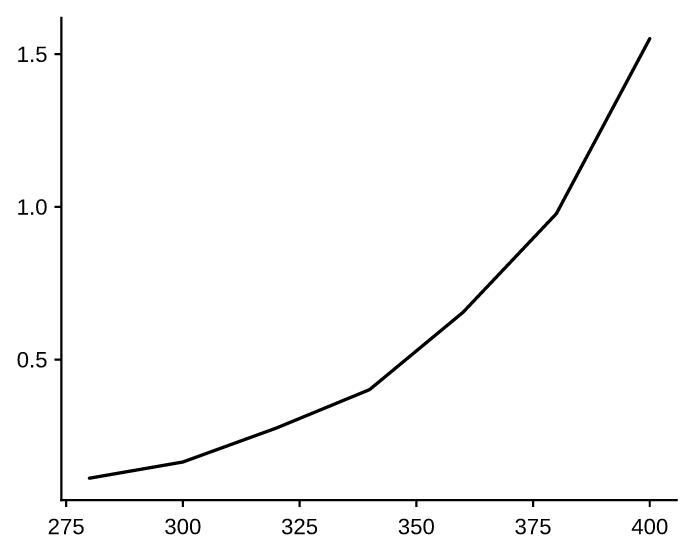
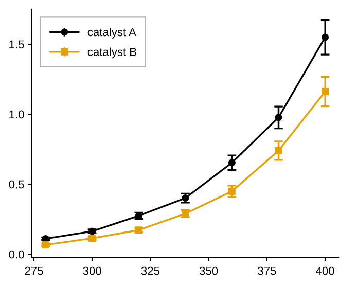
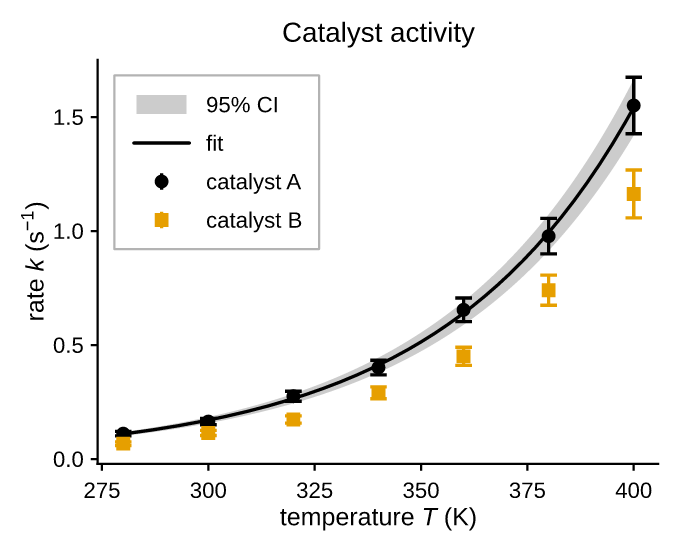
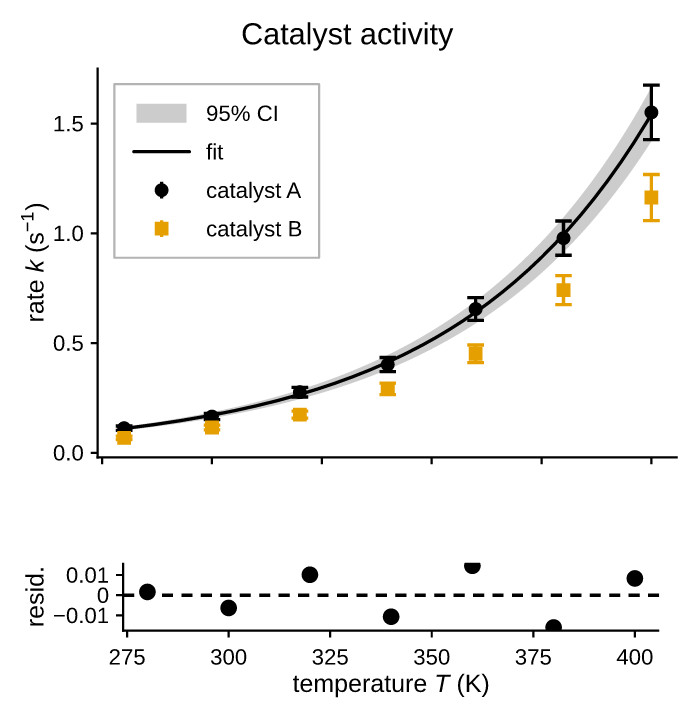
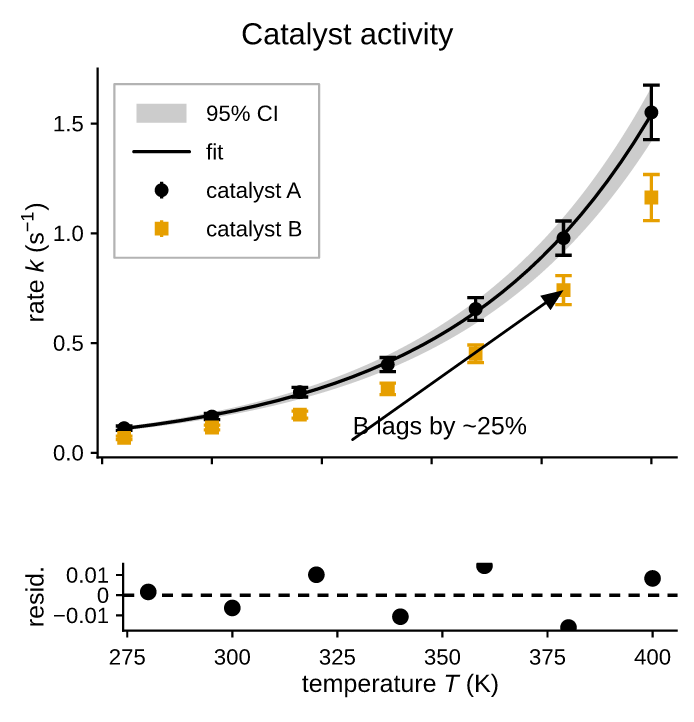

# Tutorial: a publication figure, step by step

The [quickstart](quickstart.md) showed the shape of the API. This page builds
one real figure the whole way: raw measurements in, a two-panel figure with a
fit, a confidence band, math labels and a residual strip out — ready to drop
into a manuscript.

Every snippet below is a step of the same script. Run them in order in a
notebook, or paste the final one into a file.

## The data

Plain Python lists. pyplotrs has no NumPy dependency, and nothing here needs
one — reaction rate against temperature for two catalysts, with the standard
error of each measurement:

```python
import math
import pyplotrs as plt

temp   = [280, 300, 320, 340, 360, 380, 400]
rate_a = [0.112, 0.165, 0.276, 0.402, 0.655, 0.978, 1.551]
rate_b = [0.068, 0.115, 0.174, 0.291, 0.451, 0.741, 1.163]
err_a  = [0.010, 0.014, 0.022, 0.032, 0.052, 0.078, 0.124]
err_b  = [0.008, 0.011, 0.016, 0.026, 0.040, 0.066, 0.105]
```

## Step 1 — look at it

Before styling anything, see the numbers:

```python
fig, ax = plt.subplots()
ax.line(temp, rate_a)
fig
```

{ width="300" }

`subplots()` gave a 250×200 pt canvas — a single journal column — so this is
already at the size it will be printed. In a notebook, the bare `fig` at the end
of a cell displays it; in a script, call `fig.save(...)`.

## Step 2 — the right mark

These are measurements with an uncertainty, so they want
[`errorbar`][pyplotrs.axes.Axes.errorbar], not a line. Add the second catalyst,
give both a `label`, and ask for a legend:

```python
fig, ax = plt.subplots()
ax.errorbar(temp, rate_a, yerr=err_a, marker="o", label="catalyst A")
ax.errorbar(temp, rate_b, yerr=err_b, marker="s", label="catalyst B")
ax.legend()
fig
```

{ width="300" }

Two things happened without being asked for. The second series took the next
color from the theme palette (Okabe-Ito, colorblind-safe), and `legend()` drew
keys that mirror the marks — same color, same marker, same line style. A legend
that can disagree with its plot is a legend you have to check; this one is built
from the marks themselves.

## Step 3 — a fit, a band, and real labels

Fit the trend, draw it as a line, and shade its confidence band with
[`fill_between`][pyplotrs.axes.Axes.fill_between]. Marks draw in the order you
add them, so the band goes down first, then the fit, then the points on top:

```python
def fit(ts, ys):
    """Least squares of log y = log A + k·u, with u = (t - 280)/100."""
    us = [(t - 280) / 100.0 for t in ts]
    ls = [math.log(y) for y in ys]
    ubar, lbar = sum(us) / len(us), sum(ls) / len(ls)
    k = (sum((u - ubar) * (l - lbar) for u, l in zip(us, ls))
         / sum((u - ubar) ** 2 for u in us))
    return math.exp(lbar - k * ubar), k

A, K = fit(temp, rate_a)
model = lambda t: A * math.exp(K * (t - 280) / 100.0)

fine = [280 + i for i in range(121)]
curve = [model(t) for t in fine]
band = [0.08 * y for y in curve]

fig, ax = plt.subplots()
ax.fill_between(fine, [y - e for y, e in zip(curve, band)],
                [y + e for y, e in zip(curve, band)],
                color="C0", alpha=0.2, label="95% CI")
ax.line(fine, curve, color="C0", label="fit")
ax.errorbar(temp, rate_a, yerr=err_a, marker="o", linestyle="none",
            color="C0", label="catalyst A")
ax.errorbar(temp, rate_b, yerr=err_b, marker="s", linestyle="none",
            color="C1", label="catalyst B")
ax.set(title="Catalyst activity",
       xlabel=r"temperature $T$ (K)",
       ylabel=r"rate $k$ (s$^{-1}$)")
ax.legend(loc="upper left")
fig
```

{ width="320" }

Three things worth naming:

- **`color="C0"`** is *this theme's* first palette color, not a fixed blue. The
  band, the fit and the points share it because they are one story; switch the
  theme and all three move together.
- **`linestyle="none"`** on the error bars leaves the markers and whiskers but
  drops the connecting line — the fit is the line now.
- **`$...$` in the labels** is real LaTeX math, typeset by pyplotrs' own engine.
  Write those strings raw (`r"..."`) so Python leaves the backslashes alone. In
  the saved PDF the `s⁻¹` stays selectable text, not a picture of text.

## Step 4 — a second panel

A residual strip under the main panel is the standard way to show how well the
fit does. Two rows, sharing x, with the top panel three times as tall:

```python
fig, (top, bottom) = plt.subplots(2, 1, figsize=(250, 260), sharex=True,
                                  height_ratios=[3, 1])

# ... the same four marks as before, on `top` ...
top.set(ylabel=r"rate $k$ (s$^{-1}$)", xticklabels=[])
top.legend(loc="upper left")

resid = [r - model(t) for t, r in zip(temp, rate_a)]
bottom.axhline(0.0, linestyle="dashed")
bottom.scatter(temp, resid, color="C0")
bottom.set(xlabel=r"temperature $T$ (K)", ylabel="resid.",
           yticks=[-0.01, 0.0, 0.01])

fig.set(suptitle="Catalyst activity")
fig
```

{ width="320" }

- **`height_ratios=[3, 1]`** weights the rows. Only the proportions matter, and
  the gutter between panels keeps its size, so the weighting moves the panels
  rather than the space between them.
- **`sharex=True`** unifies the x range across both panels so they line up.
  Each panel still draws its own tick labels, which is duplication here — so the
  top panel blanks its own with `xticklabels=[]`.
- **`axhline`** is a *guide*: it spans the panel and never affects autoscaling.
  Its data-coordinate sibling is `hlines`.
- **`yticks=[...]`** pins the residual ticks to round numbers instead of the
  five the locator would fit into a short panel. Pinned positions outside the
  view are dropped, so this is safe even if the residuals shrink.
- **`fig.set(suptitle=...)`** is figure-level chrome; the per-panel title moved
  out of the axes since it now describes both.

## Step 5 — call out what matters

[`annotate`][pyplotrs.axes.Axes.annotate] points text at a data coordinate:

```python
top.annotate("B lags by ~25%", (380, 0.741), xytext=(332, 0.06))
```

{ width="320" }

`xy` is the point being described, `xytext` where the label sits — both in data
space. Pass `arrow=False` for a floating label with no leader.

## Step 6 — save it

```python
fig.save("catalyst.pdf")                 # for the manuscript
fig.save("catalyst.png", dpi=600)        # for the slide deck
fig.save("catalyst.html")                # for the lab notebook / web
```

The PDF is the point of the exercise: its text is genuine embedded, subsetted
font data, so a co-author can open it in Illustrator and re-type a label without
the figure being regenerated. Check it yourself:

```bash
pdftotext catalyst.pdf - | head    # the labels come out as text
pdffonts catalyst.pdf              # the embedded subsets
```

If the figure is going somewhere that has to be accessible, add a tagged
structure and alt text:

```python
fig.save("catalyst.pdf", tagged=True, title="Figure 2",
         alt="Reaction rate against temperature for two catalysts, "
             "with an exponential fit and residuals.")
```

## Step 7 — retarget it

Nothing above is tied to one output style. The same figure code takes a
`theme`, so the manuscript version and the slide version differ by one word:

```python
fig, (top, bottom) = plt.subplots(2, 1, figsize=(250, 260), sharex=True,
                                  height_ratios=[3, 1], theme="presentation")
```

And a journal with a hard column width takes its units directly:

```python
plt.subplots(figsize=(89, 120), units="mm")   # one Nature column
```

Because a theme is an argument rather than global state, two figures with
different themes can be built in the same script — or the same thread — without
either one leaking into the other.

## Where to go next

- [The notebooks](notebooks/index.md) — the same material to run rather than
  read, including this figure built up in
  [layout and composition](notebooks/04_layout_and_composition.ipynb)
- [Plot types](guide/plot-types.md) — the full mark vocabulary
- [Layout](guide/layout.md) — mosaics, spanning panels, insets, twin axes
- [Scales & ticks](guide/scales-and-ticks.md) — log axes, dates, categories,
  formatters
- [Styling & themes](guide/styling-and-themes.md) — deriving your own theme
- [Saving figures](guide/saving.md) — what each format guarantees
